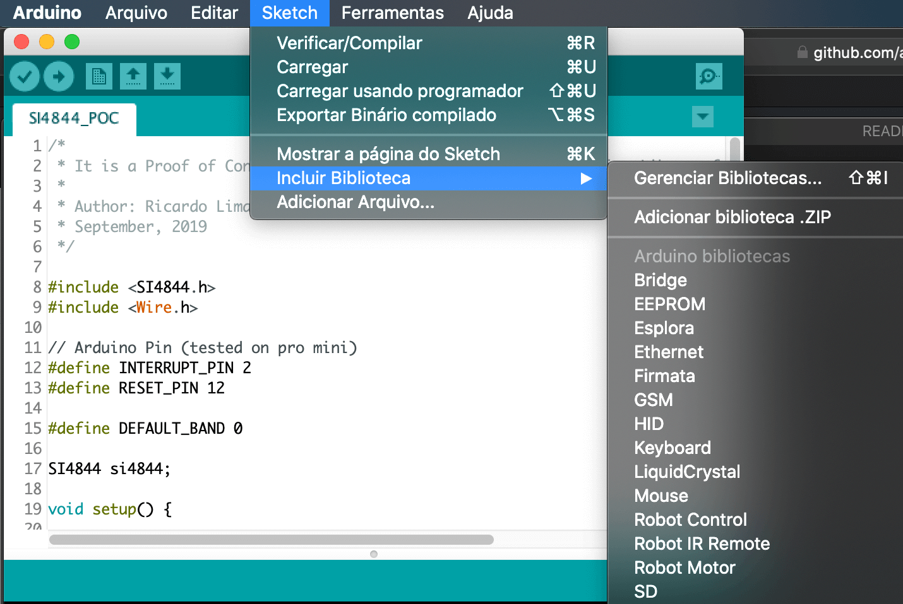
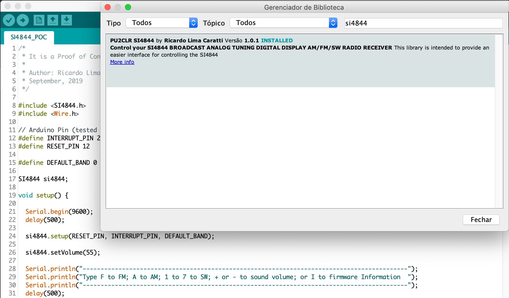

# Biblioteca Arduino para o Si4844 

Esta é uma bibnlioteca para o SI4844, BROADCAST ANALOG TUNING DIGITAL DISPLAY AM/FM/SW RADIO RECEIVER, uma Circuito Integrado fabricado pela Silicon Labs. É especialmente destinada aos interessados em controlar este dispositivo via o ambiente de desenvolvimento Arduino. 

__É importante ressaltar que o dispositivo SI4844 opera com +3.3V. Se você pretende usar uma versão do Arduino de 5V, será necessário o uso de um conversor de 5V para 3.3V.__ 


Há alguns [exemplos](https://github.com/pu2clr/SI4844/blob/master/examples/SI4844_POC/SI4844_POC.ino) nesta biblioteca que poderão auxiliá-lo na construção de seu projeto. Com estes exemplos, é possível executar as principais funções do Si4844 via o Monitor Serial (Serial Monitor) do ambiente de desenvolvimento do Arduino (IDE).

Por Ricardo Lima Caratti / PU2CLR, Outunro de 2019. 

## Sumário
1. [Seu suporte é importante](https://github.com/pu2clr/SI4844/blob/master/README-PT-BR.md#seu-suporte-%C3%A9-importante)
2. [Sobre a Arquitetura do SI4844](https://github.com/pu2clr/SI4844/blob/master/README-PT-BR.md#sobre-a-arquitetura-do-si4844)
3. [Terminologia](https://github.com/pu2clr/SI4844/blob/master/README-PT-BR.md#terminologia)
4. [Características da Biblioteca](https://github.com/pu2clr/SI4844/blob/master/README-PT-BR.md#caracter%C3%ADsticas-da-biblioteca)
5. [Instalação da Biblioteca](https://github.com/pu2clr/SI4844/blob/master/README-PT-BR.md#instala%C3%A7%C3%A3o-da-biblioteca)
6. [Requisitos de Hardware e Configuração](https://github.com/pu2clr/SI4844/blob/master/README-PT-BR.md#requisitos-de-hardware-e-configura%C3%A7%C3%A3o)
   1. [Esquema](https://github.com/pu2clr/SI4844/blob/master/README-PT-BR.md#esquema)
   2. [Componentes](https://github.com/pu2clr/SI4844/blob/master/README-PT-BR.md#componentes)
   3. [Fotos](https://github.com/pu2clr/SI4844/blob/master/README-PT-BR.md#fotos)
7. [Um exemplo usando esta Biblioteca Arduino](https://github.com/pu2clr/SI4844/blob/master/examples/SI4844_POC/SI4844_POC.ino)
8. [Documentação da API](https://github.com/pu2clr/SI4844/blob/master/README-PT-BR.md#documenta%C3%A7%C3%A3o-da-api)
   1. [Estruturas e Tipos Definidos de Dados](https://github.com/pu2clr/SI4844/blob/master/README-PT-BR.md#estruturas-e-tipos-definidos-de-dados)
   2. [Métodos Públicos](https://github.com/pu2clr/SI4844/blob/master/README-PT-BR.md#public-methods)
      * [setup](https://github.com/pu2clr/SI4844/blob/master/README-PT-BR.md#setup)
      * [reset](https://github.com/pu2clr/SI4844/blob/master/README-PT-BR.md#reset)
      * [powerDown](https://github.com/pu2clr/SI4844/blob/master/README-PT-BR.md#powerdown)
      * [setBand](https://github.com/pu2clr/SI4844/blob/master/README-PT-BR.md#setCustomBand)
      * [setCustomBand](https://github.com/pu2clr/SI4844/blob/master/README-PT-BR.md#setband)
      * [changeVolume](https://github.com/pu2clr/SI4844/blob/master/README-PT-BR.md#changevolume)
      * [setVolume](https://github.com/pu2clr/SI4844/blob/master/README-PT-BR.md#setvolume)
      * [setAudioMode](https://github.com/pu2clr/SI4844/blob/master/README-PT-BR.md#setaudiomode)
      * [getStatus](https://github.com/pu2clr/SI4844/blob/master/README-PT-BR.md#getstatus)
      * [getFirmware](https://github.com/pu2clr/SI4844/blob/master/README-PT-BR.md#getfirmware)
      * [getFrequency](https://github.com/pu2clr/SI4844/blob/master/README-PT-BR.md#getfrequency)
      * [hasStatusChanged](https://github.com/pu2clr/SI4844/blob/master/README-PT-BR.md#hasstatuschanged)  
      * [resetStatus](https://github.com/pu2clr/SI4844/blob/master/README-PT-BR.md#resetstatus)
      * [getBandMode](https://github.com/pu2clr/SI4844/blob/master/README-PT-BR.md#getbandmode)
      * [getStereoIndicator](https://github.com/pu2clr/SI4844/blob/master/README-PT-BR.md#getstereoindicator)
      * [getStatusBCFG0](https://github.com/pu2clr/SI4844/blob/master/README-PT-BR.md#getstatusbcfg0)
      * [getStatusBCFG1](https://github.com/pu2clr/SI4844/blob/master/README-PT-BR.md#getstatusbcfg1)
      * [getStatusStereo](https://github.com/pu2clr/SI4844#getstatusstereo)
      * [getStatusStationIndicator](https://github.com/pu2clr/SI4844#getstatusstationindicator)
      * [getStatusInformationReady](https://github.com/pu2clr/SI4844#getstatusinformationready)
      * [getStatusHostPowerUp](https://github.com/pu2clr/SI4844#getstatushostpowerup)
      * [getStatusHostReset](https://github.com/pu2clr/SI4844#getstatushostreset)
      * [getStatusBandMode](https://github.com/pu2clr/SI4844#getstatusbandmode)
      * [getStatusBandIndex](https://github.com/pu2clr/SI4844#getstatusbandindex)
      * [getStatusCTS](https://github.com/pu2clr/SI4844#getstatuscts)
      * [getFirmwareErr](https://github.com/pu2clr/SI4844#getfirmwareerr)
      * [getFirmwareCTS](https://github.com/pu2clr/SI4844#getfirmwarects)
      * [getFirmwarePartNumber](https://github.com/pu2clr/SI4844#getfirmwarepartnumber)
      * [getFirmwareMajorRevision](https://github.com/pu2clr/SI4844#getfirmwaremajorrevision)
      * [getFirmwareMinorRevision](https://github.com/pu2clr/SI4844#getfirmwareminorrevision)
      * [getFirmwareComponentMajorRevision](https://github.com/pu2clr/SI4844#getfirmwarecomponentmajorrevision)
      * [getFirmwareComponentMinorRevision](https://github.com/pu2clr/SI4844#getfirmwarecomponentminorrevision)
      * [getFirmwareChipRevision](https://github.com/pu2clr/SI4844#getfirmwarechiprevision) 
9. [Referências]()
10. [Vídeos]() 


## Seu suporte é importante

Se você tem interesse em fornecer suporte de desenvolvimento a esta biblioteca, junte-se à este projeto via Github. Se preferir, faça sugestões sobre funcionalidades que você gostaria que estivesse disponível nesta biblioteca. 

## Sobre a Arquitetura do SI4844 

O SI4844 um rádio receptor AM/FM/OC. Ele possui um Sintonizador Analógico que permite a seleção de estações por meio de um potenciômetro (resistor variável). O SI4844 permite também a execução de comandos enviados via um microcontrolador para executar tarefas como: mudança de banda, volume, obter a frequência corrente para ser exibida em display entre outras. Há várias informações importante que podem ser de interesse para um projetista de rádio e que pode ser obtida por meio desta biblioteca para o Arduino. 
    

Conheça mais sobre a arquitetura do SI4844 na publicação da Silicon Labs [BROADCAST ANALOG TUNING DIGITAL DISPLAY AM/FM/SW RADIO RECEIVER](https://www.silabs.com/documents/public/data-sheets/Si4840-44-A10.pdf) 


## Terminologia

| Termo | Descrição  |
|------|--------|
| Bibliotecas Arduino | Se referem a arquivos escritos em C or C++ (.c, .cpp) capazes de fornecer funcionalidades extras aos seu Sketch Arduino. Neste contexto, a Biblioteca para o SI4844  fornece funcionalidades extras para controlar um rádio baseado no SI4844 | 
|IDE   |Ambiente integrado de Desenvolvimento (do Inglês: Integrated Development Environment)|      
|Sketch|Um nome utilizado pelo ambiente Arduino para um programa. Basicamente é o arquivo principal de um programa Arduino|
|ATDD  | Do Inglês, Analog Tune Digital Display. O termo ATDD é usado para se referir ao dispositivo (CI) SI4844 |
|interrupt (interrupção| No contexto deste documento, uma interrupção é um recurso do Arduino que permite a execução de tarefas importantes independentemente do fluxo de execução corrente do seu programa |
|C++| É uma linguagem de programação orientada a objetos. Pode ser entendida como uma extensão da linguagem C que permite o desenvolvimento de programas e bibliotecas usando a abordagem Orientada a Objetos.  |
|Guia de Programação| Se refere ao manual da Silicon Labs [Si48XX ATDD PROGRAMMING GUIDE](https://www.silabs.com/documents/public/application-notes/AN610.pdf)|
|POC| Do Inglês, Proof of Concept ou em Português, Prova de Conceito. Trata-se de uma abordagem para avaliar um dado produto, modelo ou ideia |


## Características da Biblioteca

1. Open Source (Código Aberto)
2. Totalmente construída baseada no [Si48XX ATDD PROGRAMMING GUIDE](https://www.silabs.com/documents/public/application-notes/AN610.pdf)
3. Mais de 30 funções (métodos) implementadas
4. Definição de banda e faixas de frequências personalizada para OC (2.3–5.6 MHz e 22–28.5 MHz )
5. Linguagem C++ e Programação Orientada a Objetos
6. Disponível no ambiente de desenvolvimento do Arduino (IDE)
7. Simplifica projetos baseados no SI4844


## Instalação da Biblioteca

É possível Instalar esta biblioteca em seu Ambienbte usando o proprio Gerenciador de Bibliotecas do Arduino. Para tanto, selecione a opção de menu __Sketch__ -> __Incluir Biblioteca__ -> Gerenciar Biblioteca. Por fim tecle na caixa de busca o texto PU2CLR Si4844.

The images below show that actions






## Requisitos de Hardware e Configuração

Conforme dito anteriormente, esta biblioteca foi escrita para a Plataforma Arduino e foi testada com sucesso no Arduino Pro Mini. Acredito que ela também funcionará em outras placas Arduino diferentes do Pro Mini. Contudo, é importante ressaltar que o dispositivo SI4844 opera com +3.3V. Se você não estiver usando uma versão Arduino de 3.3 V, será necessário o uso de um conversor de 5V para 3.3V.

Por fim, para usar esta biblioteca, é necessário construir um rádio baseado no SI4844. 
Os esquemas e fotos a seguir mostram como construir um rádio simples baseado no SI4844. 

### Esquema

Note no esquema proposta a seguir, que o Amplificador de sinal não é necessário para elaboração de um teste. Esta parte do circúito está destacada em vermelho. 


__Fonte:__ [Raymond Genovese, May 26, 2016 - How to Build an Arduino-Controlled AM/FM/SW Radio](https://www.allaboutcircuits.com/projects/build-an-arduino-controlled-am-fm-sw-radio/)
 

__Atenção__:  Se você não estiver utilizando o Arduino Pro Mini, verifique a pinagem correta para interrupt (IRQ), RST, SDIO and  SCLK  do seu Arduino.  A tabela a seguir apresenta a pinagem de algumas placas de Arduinos.

|Board | Interrupt (IRQ) Pins| I2C / TWI pins |
|------|---------------------| ---------------|
|328-based <br> (Nano, Mini ou Uno) |	2 and 3 | A4 (SDA / SDIO), A5 (SCL / SCLK) |
| Mega | 2, 3, 18, 19, 20 e  21 | 20 (SDA/SDIO) e 21 (SCL/SCLK) |
| 32u4-based <br> (Micro, Leonardo or Yum)	| 0, 1, 2, 3 e 7| 2 (SDA/SDIO) e 3 (SCL/SCLK) |
| Zero | todos os pinos exceto o 4 | D8 (SDA/SDIO) e D9 (SCL/SCLK) |
| Due	| todos os pinos digitais | 20 (SDA/SDIO) e 21 (SCL/SCLK) |
| 101	| todos os pinos digitais. <br> Somente os pinos 2, 5, 7, 8, 10, 11, 12 e 13 funcionam com CHANGE| ------ |


O documento [BROADCAST ANALOG TUNING DIGITAL DISPLAY AM/FM/SW RADIO RECEIVER](https://www.silabs.com/documents/public/data-sheets/Si4840-44-A10.pdf), capítulo 2, página 11,  tem um esquema mais simplificado ainda deste rádio. 

A figura a segui apresenta este esquema


__Fonte: Silicon Labs (Si4840/44-A10)__

### Componentes

Listas de componentes utilizados 

A tabela a seguir é baseada na publicação de [Raymond Genovese, May 26, 2016 - How to Build an Arduino-Controlled AM/FM/SW Radio](https://www.allaboutcircuits.com/projects/build-an-arduino-controlled-am-fm-sw-radio/) .  

|Componente	| Descrição |
|-------| ------------ |
|(*1) B1 	| ferrite bead 2.5 kOhm (100 mHz) B1, ferrite bead 2.5 kOhm (100 mHz), 81-BLM18BD252SZ1D |
|C1,C2,C5 |	4.7uF capacitor não  polarizado |
|C3,C4 |	22pF capacitor não  polarizado |
|C6,C7,C9 |	.1uF capacitor não  polarizado |
|(*2) C8	| __4.7uf capacitor não  polarizado__ (atenção: no esquema original, este valor é 47uF) |
|C10, (*1) C11 |	.47uF capacitor não  polarizado |
|(*1) C12, (*1) C14 |	33nF capacitor não  polarizado |
|C13	| 33pF capacitor não  polarizado |
|(*1) C15	| 10pF capacitor não  polarizado |
|IC1	| Si4844-A10 radio receiver |
|(*1) Q1	| SS9018 NPN transistor |
|R1, R2	| 2.2K |
|(*1) R3	| 1K |
|R4, (*1) R7	| 100K |
|(*1) R5	| 10 Ohms |
|(*1) R6	| 120K |
|R8	| 100 Ohms |
|L1	| 270 nH Indutor (0,270 uH) |
|VR1 |	100K Poteciômetro Linear |
|Y1	| 32.768 kHz crital |
|ANT1 |	Antena de ferrite |
|ANT2 | Antena telescópica |

1. (*1) - Não utilizado neste projeto.
2. (*2) - O valor que utilizei foi 4.7uF e não o valor sugerido no esquema original (47uF).


### Fotos 

### Soldagem do SI4844 no adaptador

Foi um pouco difícil fazer a soldagem de um componente tão pequeno no adaptador. Contudo, com o uso de uma lente de aumento eletrônica e uma caneta (ferro de solda) foi possível fazer o trabalho. 


#### Protoboard


## Documentação da API


A Biblioteca SI4844 foi desenvolvida em C++.  Para utilizá-la, inclua o arquivo SI4844.h e declare em seu Sketch uma variável da classe SI4844. Após instalar a Biblioteca no Arduino, você deve incluí-la em seu código conforme apresentado no código a seguir.


```cpp
// 
#include <SI4844.h>   
#include <Wire.h>

// Arduino Pin (tested on pro mini)
#define INTERRUPT_PIN 2
#define RESET_PIN 12


#define DEFAULT_BAND 4

SI4844 si4844; 

void setup() {

    // Initiate and connect the device ATDD (SI4844) to Arduino
    si4844.setup(RESET_PIN, INTERRUPT_PIN, DEFAULT_BAND);

}

void loop() {


  // if something changed on ATDD (SI4844), do something  
  if (si4844.hasStatusChanged())
  {
    Serial.print("Band Index: ");
    Serial.print(si4844.getStatusBandIndex());
    Serial.print(" - ");
    Serial.print(si4844.getBandMode());
    Serial.print(" - Frequency: ");    
    Serial.print(si4844.getFrequency(),0);
    Serial.print(" KHz");
    Serial.print(" - Stereo ");
    Serial.println(si4844.getStereoIndicator());
  }

}
```


Veja um exemplo compreto em  [Proof of Concept for SI4844 Arduino Library](https://github.com/pu2clr/SI4844/tree/master/examples/SI4844_POC). 


### Estruturas e Tipos Definidos de Dados

O objetivo das estruturas de dados e tipos definidos apresentados a seguir é tornar a programação para o dispositivo SI4844 mais simples. 


```cpp
/* 
 * A estrutura a seguir representa a resposta de 4 bytes obtida pelo comando ATDD_GET_STATUS
 * Veja as páginas 14 e 15 do Guia de Programação 
 */
typedef struct
{
  byte BCFG0 : 1;     // Bit 0
  byte BCFG1 : 1;     // bit 1
  byte STEREO : 1;    // bit 2
  byte STATION : 1;   // bit 3
  byte INFORDY : 1;   // bit 4
  byte HOSTPWRUP : 1; // bit 5
  byte HOSTRST : 1;   // bit 6
  byte CTS : 1;       // bit 7
  byte BANDIDX : 6;   // Form bit 0 to 5
  byte BANDMODE : 2;  // From bit 6 to 7
  byte d2 : 4;        // Frequency digit 2
  byte d1 : 4;        // Frequency digit 1
  byte d4 : 4;        // Frequency digit 4
  byte d3 : 4;        // frequency digit 3
} si4844_get_status;
```


```cpp
/*
 * A seguir tem-se um recurso da linguagem C (union) para representar os mesmos dados armazenados
 * em uma dad posição de memória de duas formas diferentes. Desta forma, ao receber 4 bytes, será 
 * possivel representá-los segundo a estrutura anterior.
*/
typedef union {
  si4844_get_status refined;
  byte raw[4];
} si4844_status_response;
```


```cpp
/*
 * A estrutura a seguir representa os 9 bytes obtidos pelo comando GET_REV.
 * Veja a página 22 do Guia de Programação. 
 */
typedef struct
{
  byte RESERVED : 6; // Bit 0 to 5
  byte ERR : 1;      // bit 6
  byte CTS : 1;      // bit 2
  byte PN;           // Final 2 digits of Part Number (HEX).
  byte FWMAJOR;      // Firmware Major Revision (ASCII).
  byte FWMINOR;      // Firmware Minor Revision (ASCII).
  byte CMPMAJOR;     // Component Major Revision (ASCII).
  byte CMPMINOR;     // Component Minor Revision (ASCII).
  byte CHIPREV;      // Chip Revision (ASCII).
} si4844_firmware_info;
```


```cpp
typedef union {
  si4844_firmware_info refined;
  byte raw[9];
} si4844_firmware_response;
```


### Public Methods


#### setup

```cpp
/*
* Conecta o SI4844 ao Arduino e Instancia e configura alguns parâmetros necessários
* para o funcionamento do rádio. Esta função deve ser a primeira a ser chamada.
* @param resetPin  Pino do Arduino para executar a ação de reset do SI4844
* @param interruprPin Pino do Arduino para executar uma interrupção    
* @param defaultBand A banda que o rádio deve iniciar (Banda Padrão)
*/
void SI4844::setup(unsigned int, unsigned int, byte)
```
Example:
```cpp
  si4844.setup(12, 2, 4);
```

Exemplo: 

```cpp
SI4844 si4844; 

void SI4844::setup() {
  Serial.begin(9600);
  delay(500);  
  si4844.setup(RESET_PIN, INTERRUPT_PIN, DEFAULT_BAND);
  // Configure the Pre-defined Band (band index 40) to work between 27.0 to 27.5 MHz
  // See Si48XX ATDD PROGRAMMING GUIDE, pages 17,18,19 and 20.
  si4844.setCustomBand(40,27000,27500,5);  

}
```

#### reset

```cpp
/*
 * Reinicia o SI4844.
 * Veja as páginas 7, 8, 9 e 10 do Guia de Programação.
 */
void SI4844::reset(void )
```
Example:
```cpp
  si4844.reset();
```

### powerDown

```cpp
/*
 * Coloca o rádio em modo desligado. 
 * See Si48XX ATDD PROGRAMMING GUIDE; AN610; page 45
 */
void SI4844::powerDown(void)
```


#### setBand

```cpp
/*
 * Muda a banda do rádio.
 * Veja a tabela 8. Pre-defined Band Table in Si48XX ATDD PROGRAMMING GUIDE; AN610; páginas 17 and 18  
 */
void SI4844::setBand(byte);
```

Example:
```cpp
  si4844.setBand(4); // FM
```


#### setCustomBand

```cpp
/* 
 * This method allows you to customize the frequency range of a band.
 * The SI4844 can work from 2.3–28.5 MHz on SW, 64.0–109.0MHz on FM
 * You can configure the band index 40, for example, to work between 27 to 28 MHz.
 * See Si48XX ATDD PROGRAMMING GUIDE, pages 17, 18, 19 and 20.
 * 
 * (top – button)/(bandSpace) must be betwenn 50 and 230
 * 
 * @param byte bandIndes; Predefined band index (valid values: betwenn 0 and 40)
 * @param unsigned button; Band Bottom Frequency Limit
 * @param unsigned top; Band Top Frequency Limit
 * @param byte bandSpace; Channel Spacing (use 5 or 10 - On FM 10 = 100KHz)
 * @return void
 */
void SI4844::setCustomBand(byte, unsigned, unsigned, byte ) 
```


#### changeVolume

```cpp
/*
 *  Controla o nível do volume.
 *  @param char '+' aumenta o volume do som e  '-' reduz o volume do som
 */
void SI4844::changeVolume(char);
```

Example:
```cpp
  si4844.changeVolume('+'); 
```


#### setVolume

```cpp
/*
 * Atribui um volume ao rádio, 0 é volume muito baixo e 63 é o volume mais alto possível. 
 * @param byte volumeLevel (Domínio: 0 a 63) 
 */
SI4844::setVolume(byte level)
```

Exemple:
```cpp 
  si4844.setVolume(55);
```


### setAudioMode

```cpp
/*
 * Set audio mode 
 * See Si48XX ATDD PROGRAMMING GUIDE; AN610; page 43
 * @param byte opcode (0 = Set audio mode settings; 1 = Get current audio mode settings without setting)
 * @param byte attenuation (0 => -2db; 1 => 0db)
 */
void SI4844::setAudioMode(byte opcode, byte attenuation )
```

Example:
```cpp 
  si4844.setAudioMode(1,1);
```


#### getStatus

```cpp 
/*
 * Obtém as informações corrente (atuais) do rádio. Exemplo: Frequência, banda etc.
 * Use esta função se você desejar manipular os dados retornados diretamente.  
 * Esta bibliotecas possui várias outras funções mais fáceis e diretas para obter informações do rádio. 
 * 
 * @return um ponteiro para a estrutura si4844_status_response
 */
si4844_status_response *SI4844::getStatus(void);
```
Exemple:
```cpp 
  si4844.getStatus();
```

#### getFirmware

```cpp
/*
 * Obtém informações do Firmware. Por exemplo, part number, chip revision, patch e
 * component revision numbers.
 * Em geral, você não precisará executar este métodos. Há utros métodos nesta biblioteca 
 * que poderá prover estas informações.   
 * Veja a página 22 do Guia de Programação.
 * 
 * @return um ponteiro para a estrutura si4844_firmware_info
 */
si4844_firmware_response *SI4844::getFirmware(void);
```
Exemple:
```cpp 
  si4844.getFirmware();
```

#### getFrequency

```cpp
/*
 * Obtém a frequência corrente do rádio em  KHz. 
 * Por exemplo: FM, 103900 KHz (103.9 MHz);
 *              SW, 7335 KHz (7.34 MHz, 41m)   
 * 
 * @return float Frequência em KHz.  
 */
float SI4844::getFrequency(void);
```

Exemplo:
```cpp 
    Serial.print("Frequency: ");    
    Serial.print(si4844.getFrequency(),0);
```

#### hasStatusChanged

```cpp
/*
*  Verifica se o SI4844 teve seu estado mudado. Se você mover os sintonizador, por exemplo, 
*  o estado do dispositivo é alterado. 
*
*  return true or false  
*/
bool SI4844::hasStatusChanged(void);
```

Exemple:
```cpp 
  if (si4844.hasStatusChanged())
  {
    Serial.print(" - Frequency: ");    
    Serial.print(si4844.getFrequency(),0);
    Serial.print(" KHz");
    Serial.print(" - Stereo ");
    Serial.println(si4844.getStereoIndicator());
  }
```

#### resetStatus

```cpp
void SI4844::resetStatus(void);
```


#### getBandMode

```cpp
/*
 * Obtém a Banda Corrente (FM/AM/SW)
 * @return 0 = "FM mode"; 1 = "AM mode"; 2 = "SW mode".
 */ 
inline String SI4844::getBandMode()
```

#### getStereoIndicator

```cpp
/*
 * return 0 = stereo off; 1 stereo on
 */
inline String SI4844::getStereoIndicator()
```

#### getStatusBCFG0

```cpp
/*
 * See Si48XX ATDD PROGRAMMING GUID, AN610, pages 15 and 16
 */
inline unsigned SI4844::getStatusBCFG0() 
```

#### getStatusBCFG1

```cpp
/*
 * Veja O guia de Programação, AN610, páginas 15 e 16
 */
inline unsigned SI4844::getStatusBCFG1() 
```

#### getStatusStereo

```cpp
/*
 * Retorna um número inteiro indicado se a recepção está estéreo (0 = Não e 1 = Sim)
 * Veja O guia de Programação, AN610, páginas 15 e 16
 */
inline unsigned SI4844::getStatusStereo() 
```


#### getStatusStationIndicator

```cpp
/*
 * See Si48XX ATDD PROGRAMMING GUID, AN610, pages 15 and 16
 */
inline unsigned SI4844::getStatusStationIndicator() 
```


#### getStatusInformationReady

```cpp
/*
 * See Si48XX ATDD PROGRAMMING GUID, AN610, pages 15 and 16
 */
inline unsigned SI4844::getStatusInformationReady() 
```


#### getStatusHostPowerUp
```cpp
/*
 * See Si48XX ATDD PROGRAMMING GUID, AN610, pages 15 and 16
 */
inline unsigned SI4844::getStatusHostPowerUp() 
```

#### getStatusHostReset

```cpp
/*
 * See Si48XX ATDD PROGRAMMING GUID, AN610, pages 15 and 16
 */
inline unsigned SI4844::getStatusHostReset() 
```


#### getStatusBandMode

```cpp
/*
 * See Si48XX ATDD PROGRAMMING GUID, AN610, pages 15 and 16
 */
inline unsigned SI4844::getStatusBandMode() 
```

#### getStatusBandIndex

```cpp
/*
 * See Si48XX ATDD PROGRAMMING GUID, AN610, pages 15 and 16
 */
inline unsigned SI4844::getStatusBandIndex() 
```

#### getStatusCTS

```cpp
/*
 * See Si48XX ATDD PROGRAMMING GUID, AN610, pages 15 and 16
 */
inline unsigned SI4844::getStatusCTS() 
```


#### getFirmwareErr

```cpp 
inline unsigned SI4844::getFirmwareErr()
```

#### getFirmwareCTS
```cpp
inline unsigned SI4844::getFirmwareCTS()
```

#### getFirmwarePartNumber

```cpp
/*
 * Get Firmware Final 2 digits of Part Number (HEX).
 */ 
inline unsigned SI4844::getFirmwarePartNumber() 
```
__See example below__


#### getFirmwareMajorRevision

```cpp
/*
 * Get Firmware Major Revision (ASCII).
 */ 
inline unsigned SI4844::getFirmwareMajorRevision() 
```
__See example below__


#### getFirmwareMinorRevision

```cpp
/*
 * Get Firmware Minor Revision (ASCII).
 */
inline unsigned SI4844::getFirmwareMinorRevision() 
```
__See example below__


#### getFirmwareComponentMajorRevision

```cpp
/*
 * Get Firmware Component Major Revision (ASCII).
 */ 
inline unsigned SI4844::getFirmwareComponentMajorRevision() 
```
__See example below__


#### getFirmwareComponentMinorRevision

```cpp
/* 
 * Get Firmware Component Minor Revision (ASCII).
 */
inline unsigned getFirmwareComponentMinorRevision() 
```
__See example below__


#### getFirmwareChipRevision

```cpp
/*
 * Chip Revision (ASCII).
 */
inline unsigned SI4844::getFirmwareChipRevision() 
```

Exemplo:

```cpp

  Serial.println("\nSI4844 -  Firmware information\n");

  si4844.getFirmware();
  Serial.print("Final 2 digits of Part Number..: ");
  Serial.println(si4844.getFirmwarePartNumber());
  Serial.print("Firmware Major Revision........: ");
  Serial.println(si4844.getFirmwareMajorRevision());
  Serial.print("Firmware Minor Revision........: ");
  Serial.println(si4844.getFirmwareMinorRevision());
  Serial.print("Component Major Revision.......: ");
  Serial.println(si4844.getFirmwareComponentMajorRevision());
  Serial.print("Component Minor Revision.......: "); 
  Serial.println(si4844.getFirmwareComponentMinorRevision());
  Serial.print("Chip Revision..................: ");
  Serial.println(si4844.getFirmwareChipRevision());

  Serial.println("*****************************");
  ```

## Exemplos

Na [pasta examples](https://github.com/pu2clr/SI4844/tree/master/examples) você encontrará alguns sketches que podem ser úteis para o seus projetos.

### Informações do Firmware 

O sketch [SI4844_FIRMWARE.ino](https://github.com/pu2clr/SI4844/blob/master/examples/SI4844_FIRMWARE/SI4844_FIRMWARE.ino) inicia o rádio no modo FM e apresenta as informações do Firmware.

### Um rádio mínimo com o SI4844

O sketch [SI4844_MINIMAL.ino](https://github.com/pu2clr/SI4844/blob/master/examples/SI4844_MINIMAL/SI4844_MINIMAL.ino) tem somente 35 linhas é pode ser usando como base para o seu projeto.  


### Prova de Conceito

O sketch [SI4844_POC.ino](https://github.com/pu2clr/SI4844/blob/master/examples/SI4844_POC/SI4844_POC.ino) é uma prova de conceito do uso da biblioteca Arduino. Apresenta mais funcionalidades que os exemplos anteriores. 


### Extended SW band frequency ranges from 2.3–5.6 MHz and 22–28.5 MHz 

O sketch [SI4844_CUSTOM_BAND.ino](https://github.com/pu2clr/SI4844/blob/master/examples/SI4844_POC/SI4844_CUSTOM_BAND.ino) mostra como criar uma banda personalizada, não definida previamente na tabela de bandas do SI4844.


## Referências

1. [Si48XX ATDD PROGRAMMING GUIDE](https://www.silabs.com/documents/public/application-notes/AN610.pdf)
2. [BROADCAST ANALOG TUNING DIGITAL DISPLAY AM/FM/SW RADIO RECEIVER](https://www.silabs.com/documents/public/data-sheets/Si4840-44-A10.pdf)
3. [Si4822/26/27/40/44 ANTENNA, SCHEMATIC, LAYOUT, AND DESIGN GUIDELINES](https://www.silabs.com/documents/public/application-notes/AN602.pdf)
4. [How to Build an Arduino-Controlled AM/FM/SW Radio](https://www.allaboutcircuits.com/projects/build-an-arduino-controlled-am-fm-sw-radio/)


   
## Vídeos

1. [Prova de Conceito com SI4844 e Arduino (vídeo sobre este projeto)](https://youtu.be/DAQbXZZR7VQ)

