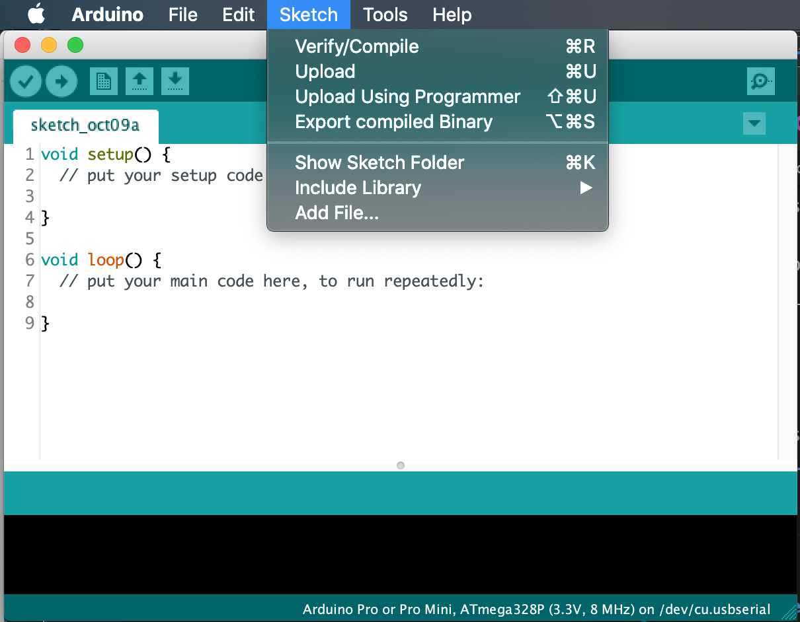
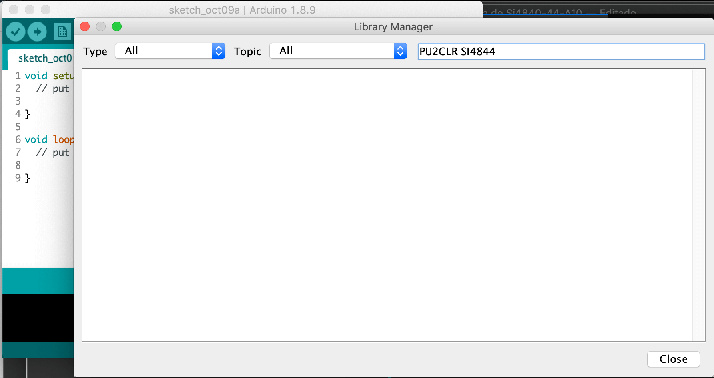
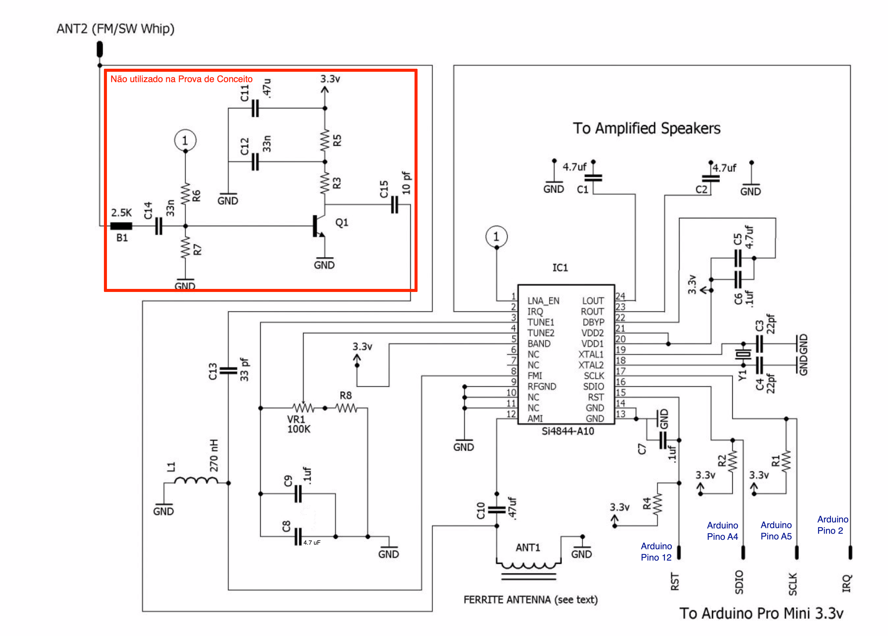
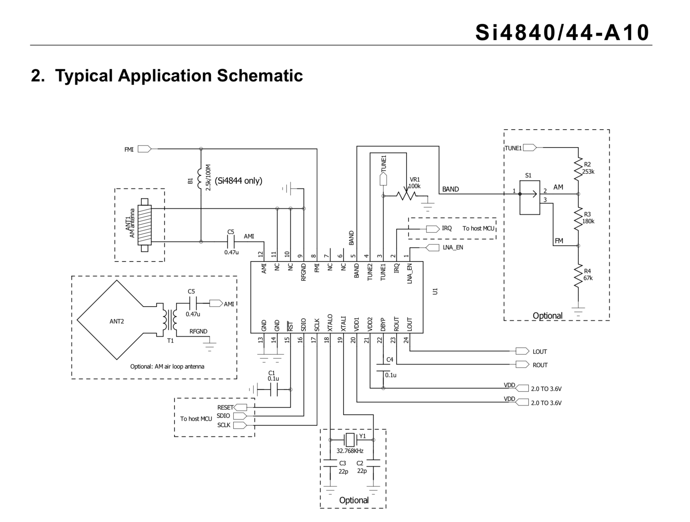
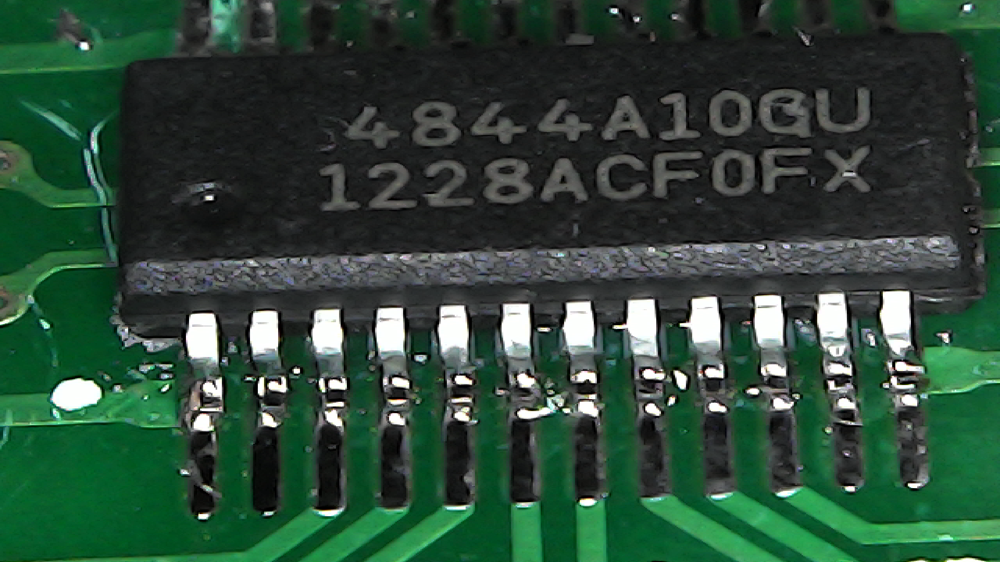
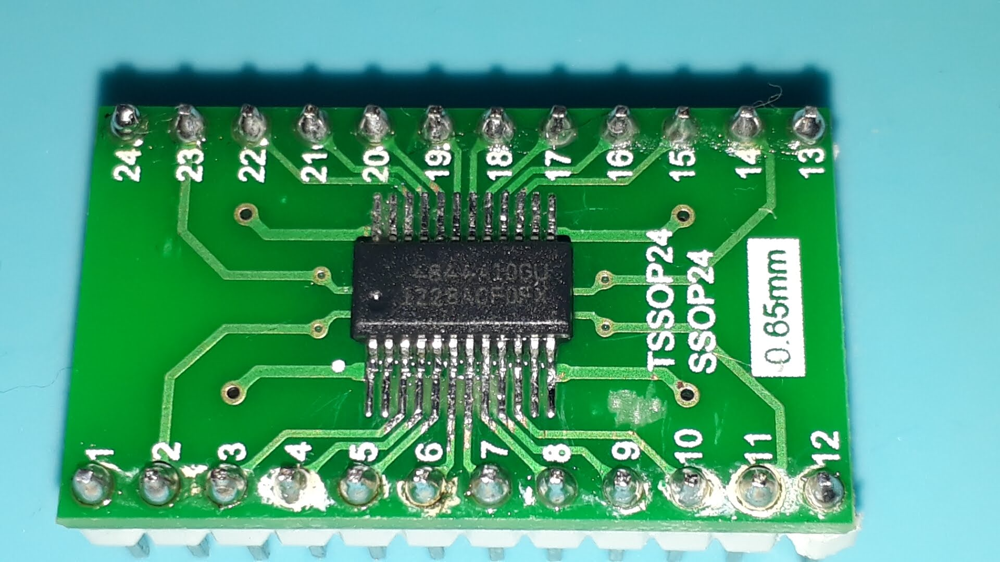
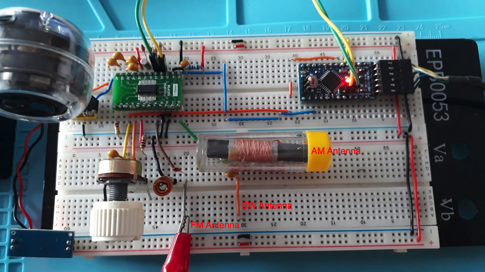

# Si4844 Library for Arduino

This is a library for the SI4844, BROADCAST ANALOG TUNING DIGITAL DISPLAY AM/FM/SW RADIO RECEIVER,  ICs from Silicon Labs for the Arduino development environment.  This library is intended to provide an easier interface for controlling the SI4844.

By Ricardo Lima Caratti, Oct, 2019. 

__Attention: Under construction.__

## Summary
1. [Your support is important](https://github.com/pu2clr/SI4844#your-support-is-important)
2. [About the SI4844 Architecture](https://github.com/pu2clr/SI4844#about-the-si4844-architecture)
3. [Library Installation](https://github.com/pu2clr/SI4844#library-installation)
4. [Hardware Requirements and Setup](https://github.com/pu2clr/SI4844#hardware-requirements-and-setup)
   1. [Schematic](https://github.com/pu2clr/SI4844#schematic)
   2. [Component Parts](https://github.com/pu2clr/SI4844#parts)
   3. [Photos](https://github.com/pu2clr/SI4844#photos)
5. [API Documentation]()
6. [References](https://github.com/pu2clr/SI4844#references)
7. [Videos](https://github.com/pu2clr/SI4844#videos) 

## Your support is important.

If you would like to support this library development, consider joining this project via Github. Thank you!

## About the SI4844 Architecture 

The Si4844 is an analog-tuned digital-display AM/FM/SW radio receiver. It has an analog-tune while frequency, band, and setero/mono information can be displayed on LCD. It works with a I2C protocol that allows a microcontroller send command and receive data. 

See more about SI4844 on [BROADCAST ANALOG TUNING DIGITAL DISPLAY AM/FM/SW RADIO RECEIVER](https://www.silabs.com/documents/public/data-sheets/Si4840-44-A10.pdf) 

## Library Installation

You can install the library is via the Arduino Library Manager. Go to the menu __Sketch__ > __Include Library__ > __Manage Libraries...__, and in the search box,  type __"PU2CLR SI4844"__.

The images below show that actions

## Hardware Requirements and Setup

This library has been written for the Arduino platform and has been successfully tested on Pro Mini. I beleave it will wotk on any other Arduino with I2C support.

The SI4844 is a +3.3 V only part. If you are not using a +3.3 V version of Arduino, you have to use a converter.

To use this labrary you need to build a radio based on SI4844 coneccted to Arduino. The schematic and photos below show the hardware and setup requirments for start using this library.

### Schematic

The signal amplifier was not required fo test. 

__Original Source:__ [Raymond Genovese, May 26, 2016 - How to Build an Arduino-Controlled AM/FM/SW Radio](https://www.allaboutcircuits.com/projects/build-an-arduino-controlled-am-fm-sw-radio/)
 
The document [BROADCAST ANALOG TUNING DIGITAL DISPLAY AM/FM/SW RADIO RECEIVER](https://www.silabs.com/documents/public/data-sheets/Si4840-44-A10.pdf), chapter two, page 11,  has a typical application schematic. 

The figure below shows that schematic

__Source: Silicon Labs (Si4840/44-A10)__

### Parts

Parts list  used by the first schematic

The table below is based on [Raymond Genovese, May 26, 2016 - How to Build an Arduino-Controlled AM/FM/SW Radio](https://www.allaboutcircuits.com/projects/build-an-arduino-controlled-am-fm-sw-radio/) .  

|Part	| Description |
|-------| ------------ |
|(*1) B1 	| ferrite bead 2.5 kOhm (100 mHz) B1, ferrite bead 2.5 kOhm (100 mHz), 81-BLM18BD252SZ1D |
|C1,C2,C5 |	4.7 uf non polarized capacitor |
|C3,C4 |	22 pf non polarized capacitor |
|C6,C7,C9 |	.1 uf non polarized capacitor |
|(*2) C8	| __4.7 uf non polarized capacitor__ (the orinal value is 47uF. I used 4.7uF) |
|C10, (*1) C11 |	.47 uf non polarized capacitor |
|(*1) C12, (*1) C14 |	33 nf non polarized capacitor |
|C13	| 33 pf non polarized capacitor |
|(*1) C15	| 10 pf non polarized capacitor |
|IC1	| Si4844-A10 radio receiver |
|(*1) Q1	| SS9018 NPN transistor |
|R1, R2	| 2.2K |
|(*1) R3	| 1K |
|R4, (*1) R7	| 100K |
|(*1) R5	| 10 Ohms |
|(*1) R6	| 120K |
|R8	| 100 Ohms |
|L1	| 270 nH Inductor (0,270 uH) |
|VR1 |	100K linear potentiometer |
|Y1	| 32.768 kHz crystal |
|ANT1 |	ferrite antenna |
|ANT2 | telescopic/whip antenna |

1. (*1) - not used for this project.
2. (*2) - the value used is 4.7uF and not 47uF as suggested by the original circuit.

### Photos 

### SI4844 soldered on adapter

It was a bit hard to solder the Si4844 on adapter. However, by using a electronic magnifier it was possible.

#### Protoboard

## References

1. [Si48XX ATDD PROGRAMMING GUIDE](https://www.silabs.com/documents/public/application-notes/AN610.pdf)
2. [BROADCAST ANALOG TUNING DIGITAL DISPLAY AM/FM/SW RADIO RECEIVER](https://www.silabs.com/documents/public/data-sheets/Si4840-44-A10.pdf)
3. [Si4822/26/27/40/44 ANTENNA, SCHEMATIC, LAYOUT, AND DESIGN GUIDELINES](https://www.silabs.com/documents/public/application-notes/AN602.pdf)
4. [How to Build an Arduino-Controlled AM/FM/SW Radio](https://www.allaboutcircuits.com/projects/build-an-arduino-controlled-am-fm-sw-radio/)

   
## Videos

1. [Prova de Conceito com SI4844 e Arduino (vídeo sobre este projeto)](https://youtu.be/DAQbXZZR7VQ)

