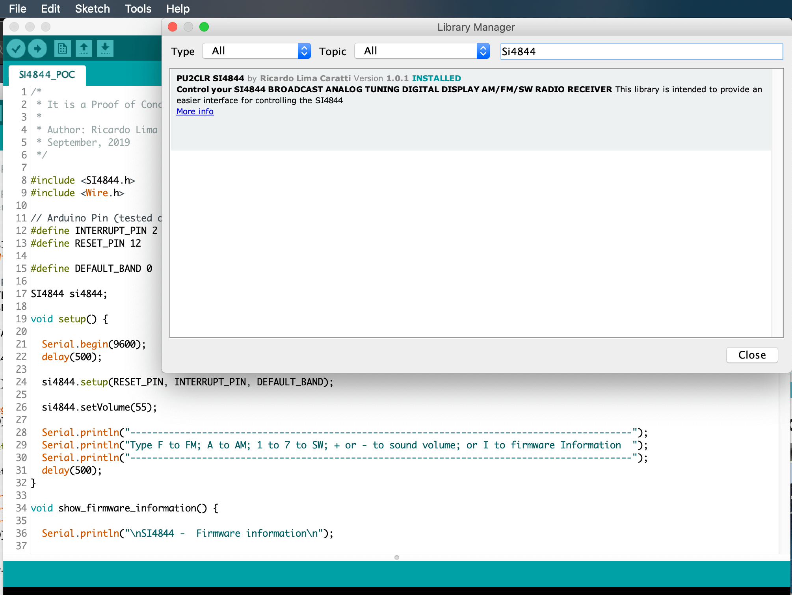
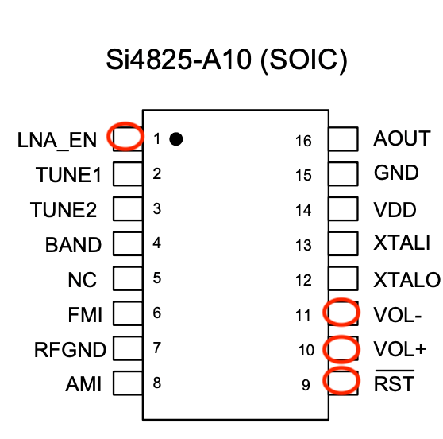
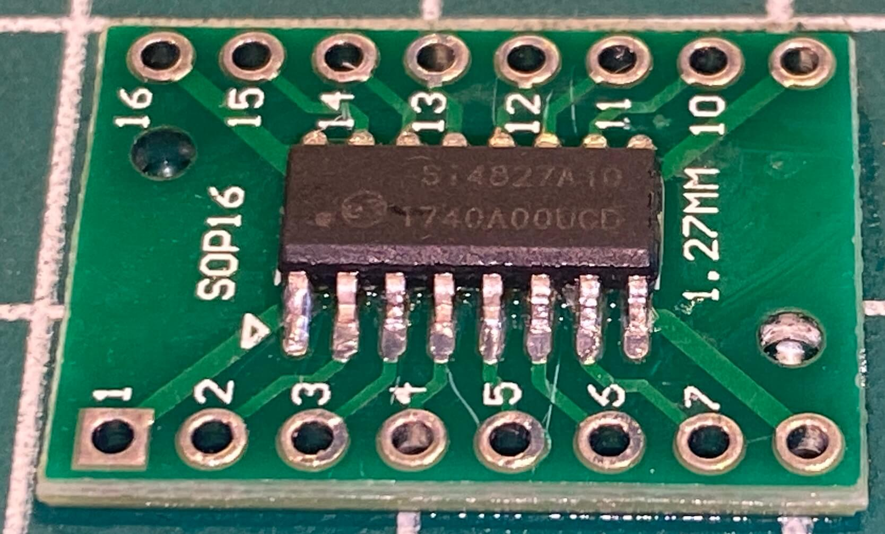

# [Si4844 Library for Arduino](https://pu2clr.github.io/SI4844/)

This Arduino library was developed to work with the **SI4822, SI4826, SI4827, SI4840, 4844A, and 4844B** "BROADCAST ANALOG TUNING DIGITAL DISPLAY AM/FM/SW RADIO RECEIVER" devices.
It is available on Arduino IDE. This library is intended to provide an easier interface to control the SI48XX family. **When appropriate, this documentation will use the acronym SI48XX to refer to the following devices: SI4822, SI4826, SI4827, SI4840, SI4844A, and SI4844B. In most cases, references to the SI4844 device also apply to the other aforementioned devices.**

The SI48XX, along with other devices in its family, provides the ideal combination of analog tuning and digital interface, enabling the development of receivers reminiscent of the iconic models from the 1970s and 1980s. These classic receivers featured visual interfaces using liquid crystal displays or LEDs, offering a unique and nostalgic user experience. Therefore, a notable application for the SI48XX is the construction of a vintage-style receiver that blends retro aesthetics with modern technology.

A less common application, but one that might catch the attention of some hobbyists, is the conversion of receivers based on the SI4825, which feature mechanical tuning and only an analog dial, into a receiver based on the SI4827. This model retains the same characteristics as the SI4825 but adds a digital interface through a display. This video shows that idea:  [Improving a Si4825-based radio with the Si4827 and Arduino](https://youtu.be/dl5ZFl_KF3c?si=FtygwYBywTiOHvSY).

It is important to highlight that the analog tuning of this device does not offer the same experience as the classic receivers with variable capacitor tuning. However, depending on how you configure your electronic project, the quality of the 100K potentiometer used for mechanical tuning, and the firmware, you might be pleasantly surprised by the results.

Use the 'Content Index' of this documentation and the example sketches, especially [SI4844_00_POC.ino](https://github.com/pu2clr/SI4844/tree/master/examples/SI4844_00_POC), to make the most of this library.

This library can be freely distributed using the MIT Free Software model. [Copyright (c) 2019 Ricardo Lima Caratti](https://github.com/pu2clr/SI4844#mit-licence)  

Contact: pu2clr@gmail.com

By Ricardo Lima Caratti, Oct 2019. 

## Donate 

If you find this project useful, consider making a donation so that the author of this library can purchase components and modules for improvements and testing of this library. [Click here to donate.](https://www.paypal.com/donate/?business=LLV4PHKTXC4JW&no_recurring=0&item_name=Consider+making+a+donation.++So+I+can+purchase+components+and+modules+for+improvements+and+testing+of+this+library.&currency_code=USD)

## About Me

I hold a Master's degree in Educational Technology from the Federal University of Ceará, where I delved into the ways technology can enhance learning experiences. My passion for computer science led me to specialize in it, focusing on Distributed Systems Development with an Object-Oriented approach, at the University of Brasília. My academic journey began with a Bachelor's degree in Information Systems from the União Pioneira de Integração Social (UPIS-Brasília). Outside the classroom, my main hobbies are electronics and Amateur Radio. 

## Contents

1. [License Copyright](https://pu2clr.github.io/SI4844/#mit-licence)
2. [Your support is important](https://pu2clr.github.io/SI4844/#your-support-is-important)
3. [About the SI4844 Architecture](https://pu2clr.github.io/SI4844/#about-the-si4844-architecture)
4. [Terminology](https://pu2clr.github.io/SI4844/#terminology)
5. [Labrary Features](https://pu2clr.github.io/SI4844/#library-features)
6. [Library Installation](https://pu2clr.github.io/SI4844/#library-installation)
7. [Hardware Requirements and Setup](https://pu2clr.github.io/SI4844/#hardware-requirements-and-setup)
   * [Schematic](https://pu2clr.github.io/SI4844/#schematic)
   * [Component Parts](https://pu2clr.github.io/SI4844/#parts)
   * [Photos](https://pu2clr.github.io/SI4844/#photos)
8. [API Documentation](https://pu2clr.github.io/SI4844/extras/apidoc/html/)
9. [References](https://pu2clr.github.io/SI4844/#references)
10. [Source code - Arduino Examples](https://pu2clr.github.io/SI4844/#examples)
11. [Videos](https://pu2clr.github.io/SI4844/#videos) 



## See also 

* [PU2CLR Si4735 Library for Arduino](https://pu2clr.github.io/SI4735/). This library was built based on “Si47XX PROGRAMMING GUIDE; AN332” and it has support to FM, AM and SSB modes (LW, MW and SW). It also can be used on all members of the SI47XX family respecting, of course, the features available for each IC version;
* [PU2CLR SI4844 Arduino Library](https://pu2clr.github.io/SI4844). This is an Arduino library for the SI4844, BROADCAST ANALOG TUNING DIGITAL * DISPLAY AM/FM/SW RADIO RECEIVER,  IC from Silicon Labs.  It is available on Arduino IDE. This library is intended to provide an easier interface for controlling the SI4844.
* [PU2CLR AKC695X Arduino Library](https://pu2clr.github.io/AKC695X/). The AKC695X is a family of IC DSP receiver from AKC technology. The AKC6955 and AKC6959sx support AM and FM modes. On AM mode the AKC6955 and AKC6959sx work on LW, MW and SW. On FM mode they work from 64MHz to 222MHz.
* [PU2CLR KT0915 Arduino Library](https://pu2clr.github.io/KT0915/). The KT0915 is a full band AM (LW, MW and SW) and FM DSP receiver that can provide you a easy way to build a high quality radio with low cost.
* [PU2CLR BK108X](https://pu2clr.github.io/BK108X/). The BK1086 and BK1088 are DSP receivers from BAKEN. The BK1088 is a BROADCAST FM and AM (LW, MW and ) RECEIVER and BK1086 is a subset of the BK1088 (it does not have LW and SW acording to the Datasheet).
* [PU2CLR RDA5807 Arduino Library](https://pu2clr.github.io/RDA5807/). The RDA5807 is a FM DSP integrated circuit receiver (50 to 115MHz) with low noise amplifier support. This device requires very few external components if compared with other similar devices. It also supports RDS/RBDS functionalities, direct auto gain control (AGC) and real time adaptive noise cancellation function.
* [PU2CLR SI470X Arduino Library](https://pu2clr.github.io/SI470X/). It is a Silicon Labs device family that integrates the complete functionalities for FM receivers, including RDS (Si4703).
* [PU2CLR MCP23008](https://pu2clr.github.io/MCP23008/). It is an Arduino Library to control the MCP23008/MCP23S08 8-Bit I/O Expander. The MCP23008 device provides 8-bit, general purpose, parallel I/O expansion. It can be controlled via I2C bus applications. It is a great and inexpensive device that allow you to add more devices to be controlled by your Arduino board via I2C protocol.
* [PU2CLR - PCF8574 Arduino Library](https://pu2clr.github.io/PCF8574/). It is an Arduino Library to control the PCF8574 8-Bit I/O Expander. The PCF8574 device provides 8-bit, general purpose, parallel I/O expansion. It can be controlled via I²C bus applications. It is a great and inexpensive device that allow you to add more peripherals to be controlled by your Arduino board via I²C protocol.
* [QN8066 FM DSP RX/TX Arduino Library](https://github.com/pu2clr/QN8066). An easy-to-use interface for controlling the QN8066 FM transceiver and receiver.

### More Arduino Projects developed by author 

* [Multipurpose signal generator with SI5351](https://pu2clr.github.io/SI5351/). It is a multipurpose signal generator controlled by Arduino. This project uses the SI5351 from Silicon Labs. The Arduino sketch is configured to control the SI5351 with three channels from 32.768KHz to 160MHz and steps from 1Hz to 1MHz.
* [Shortwave Arduino Transmitter](https://pu2clr.github.io/Small-Shortwave-Transmitter/). This project is about a shortwave transmitter from 3 MHz to 30 MHz. It uses the SI5351 oscillator from Silicon Labs controlled by Arduino. Also, you can use it with a crystal oscillator. In this case, you will not need the SI5351 device and Arduino. 
* [Android and iOS Bluetooth Remote Control for PU2CLR Arduino Library DSP receivers](https://pu2clr.github.io/bluetooth_remote_control/). This project is an extension of the Arduino library projects for: [SI4735](https://pu2clr.github.io/SI4735/); [AKC6959](https://pu2clr.github.io/AKC695X/) and [KT0915](https://pu2clr.github.io/KT0915/). It is a simple example that shows a way to use your smartphone as a remote control via Bluetooth. In order to follow the steps presented here, I am assuming that you have some knowledge in development for mobile devices. Also, you will need to be familiar with the Javascript programming language. The development environment used by this project is the [Apache Cordova](https://cordova.apache.org/docs/en/latest/guide/overview/index.html). Cordova is a open-source mobile development framework that allows you to develop cross-platform applications. That means you can code once and deploy the application in many system, including iOS and Android. 
Cordova provides an easy way to develop for iOS and Android.  
* [Band Pass Filter controlled by Arduino](https://pu2clr.github.io/auto_bpf_arduino/). It is a HF band pass filter controlled by Arduino. It is designed for HF receivers. With this project, you can use a set of up to four HF bandpass filters that can be selected by Arduino. To do that you will need just two digital Arduino pins.

## Important

__The SI48XX (SI4822, SI4826, SI4827, SI4840, 4844A, and 4844B) is a 3.3V part. If you are not using a 3.3V version of Arduino, you have to use a kind of 5V to 3.3V converter.__ See [Hardware Requirements and Setup](https://github.com/pu2clr/SI4844#hardware-requirements-and-setup).

A good alternative to the Arduino Uno or Arduino Nano for a project using the SI48XX device is a board based on the LGT8F328 microcontroller. This device offers excellent compatibility with the Arduino Nano and Uno, including pin configuration, with the added advantage of operating at 3.3V, eliminating the need for a bidirectional converter, and being more affordable. Other viable alternatives include the ESP32, ESP8266, and STM32.

Another approach to respecting the operating voltages of the SI48XX is to use the ATmega328 without the Arduino board (Standalone). This allows you to configure the system at 3V, a voltage compatible with both the SI48XX and the ATmega328. Additionally, you can configure the ATmega328 to use its internal oscillator, thereby simplifying the development of the electronic circuit.

## MIT License 

Copyright (c) 2019 Ricardo Lima Caratti

Permission is hereby granted, free of charge, to any person obtaining a copy of this software and associated documentation files (the "Software"), to deal in the Software without restriction, including without limitation the rights to use, copy, modify, merge, publish, distribute, sublicense, and/or sell copies of the Software, and to permit persons to whom the Software is furnished to do so, subject to the following conditions:

The above copyright notice and this permission notice shall be included in all copies or substantial portions of the Software.

THE SOFTWARE IS PROVIDED "AS IS", WITHOUT WARRANTY OF ANY KIND, EXPRESS OR IMPLIED, INCLUDING BUT NOT LIMITED TO THE ARRANTIES OF MERCHANTABILITY, FITNESS FOR A PARTICULAR PURPOSE AND NONINFRINGEMENT. IN NO EVENT SHALL THE AUTHORS OR COPYRIGHT HOLDERS BE LIABLE FOR ANY CLAIM, DAMAGES OR OTHER LIABILITY, WHETHER IN AN ACTION OF CONTRACT, TORT OR OTHERWISE, ARISING FROM, OUT OF OR IN CONNECTION WITH THE SOFTWARE OR THE USE OR OTHER DEALINGS IN THE SOFTWARE.

## Your support is important.

If you would like to support this library development, consider joining this project via Github. Alternatively, make suggestions on features you would like available in this library. Thank you!

## About the SI4844 Architecture 

The Si4844 is an analog-tuned digital-display AM/FM/SW radio receiver. It has an analog-tune while frequency, band, and setero/mono information can be displayed on LCD. It works with a I2C protocol that allows a microcontroller send command and receive data.  Also, with a 100K variable resistor, you can simulate a dial mechanical tuning wheel found in old or traditional receiver. In this way, you will be able to offer a look similar to the old radios.

See more about SI4844 on [BROADCAST ANALOG TUNING DIGITAL DISPLAY AM/FM/SW RADIO RECEIVER](https://www.silabs.com/documents/public/data-sheets/Si4840-44-A10.pdf) 

## Terminology

| Term | Description  |
|------|--------|
| SI48XX     | used to refer to the devices SI4822, SI4826, SI4827, SI4840, 4844A, and 4844B |
|Arduino Libraries|Libraries are files written in C or C++ (.c, .cpp) which provide your sketches with extra functionality. The SI4844 Library provides extra functionalities to make easier the Arduino deal with Si4844 device| 
| CTS | Clear to send |
|IDE   |Integrated Development Environment|   
| I²C  | [I²C - Inter-Integrated Circuit](https://pt.wikipedia.org/wiki/I²C)|    
|Sketch|Name that Arduino environment uses for a program|
|ATDD  |Analog Tune Digital Display. Sometimes used to refer the Si4844 device|
|interrupt|In this context, it is a Arduino Resource. Allows important tasks to be performed regardless of the flow of your program|
| IRQ  | the pin label of the SI48XX device  used by the SI48XX  device to notify status changing |
| RST  | the pin label of the SI48XX device  used to reset the SI48XX device | 
|C++| A object-oriented programming (OOP) language. It is a superset of the C language with an additional concept of "classes." |
|programming guide| In this context it refers to [Si48XX ATDD PROGRAMMING GUIDE](https://www.silabs.com/documents/public/application-notes/AN610.pdf)|
|POC| Proof of Concept|
| SDIO / SDA | Serial data in/data out pin|
| SCLK / SCL | Serial clock pin |

## Library Features

1. **Open Source**:  
   - Free to use, copy, modify, merge, publish, distribute, sublicense, and/or sell copies of the Software. See the [MIT License](https://github.com/pu2clr/SI4844#mit-licence) for details.  

2. **Based on Si48XX ATDD Programming Guide**:  
   - Developed in alignment with the [Si48XX ATDD Programming Guide](https://www.silabs.com/documents/public/application-notes/AN610.pdf), ensuring compatibility and reliability.

3. **Over 40 Si48XX Functions**:  
   - Includes a comprehensive set of methods for advanced control and customization.

4. **Extended SW Band Frequency Ranges**:  
   - Supports extended shortwave frequency ranges: 2.3–5.6 MHz and 22–28.5 MHz.

5. **C++ and Object-Oriented Design**:  
   - Built using the C++ language and object-oriented programming principles, offering flexibility and reusability.

6. **Arduino IDE Integration**:  
   - Available in the Arduino IDE library manager for seamless installation and updates.

7. **Simplifies SI4844-Based Projects**:  
   - Abstracts the complexities of working with the SI4844, making development faster and more accessible.

8. **Band Selection Modes**:  
   - Supports **programmatic band selection** via the MCU.  
   - Offers traditional **band selection using Slide Switch or Rotary Band Switch** through a resistor network (voltage divider).

9. **Custom Band Configuration**:  
   - Enables developers to redefine frequency ranges by customizing the lower and upper limits for each band.

10. **Pre-Defined Band Support**:  
   - Includes compatibility with the Si48XX internal band table for standard frequency setups.

11. **Dynamic Band Management**:  
   - Allows adding, removing, or modifying bands dynamically at runtime.

12. **Dual Selection Modes**:  
   - Supports both mechanical (Slide/Band Switch) and programmable (MCU-controlled) band selection methods.

13. **Low-Level Hardware Control**:  
   - Provides direct access to hardware configurations, including resistor network management and pin settings.

## Library Installation

You can install the library via the Arduino Library Manager. Go to the menu __Sketch__ > __Include Library__ > __Manage Libraries...__, and in the search box,  type __"PU2CLR SI4844"__.

The images below show that actions

You can also download this library or old version of it via this repository or via [Arduino Library List](https://www.arduinolibraries.info/libraries/pu2-clr-si4844).

## Hardware Requirements and Setup

This library has been written for the Arduino platform and has been successfully tested on Pro Mini 3.3V (8MHz), LGT8F328 (clock setup: 32kHz with prescaler ou divider set to 2 or 16 kHz or less), ESP32 and  ESP8266.

### Arduino 5V and Si4844

__The Si48XX is a 3.3V part. If you are not using a 3.3V version of Arduino, you have to use a kind of 5V to 3.3V bidirectional converter. It is important to say that just power the Si4844 device with 3.3V from Arduino board is not enough. You have to be aware that the Arduino that operates with 5V, the digital pins and the I2C bus will send 5V signals to the Si48XX device. That configuration can make the system unstable or damage the device__.

I have tested it with success the SI4844 with a 5V Arduino using the I2C Multiplexer TCA9548A, that also can work as a bidirectional converter.

See that approach [here](./extras/5V_to_3V3_CONVERTER). 

### SI4827 PINOUT 

| Pin Number | Label   | Description |
| ---------- | ------  | ----------- |
|  1         | IRQ     | Interrupt request output. Used to signal events or status changes. |
|  2         | TUNE1   | Frequency tuning control input. |
|  3         | TUNE2   | Additional frequency tuning control input. |
|  4         | BAND    | Selects the frequency band and configures de-emphasis and stereo separation. |
|  5         | NC      | No connection. These pins should be left floating. |
|  6         | FMI     | FM radio frequency input. Connect this pin to the FM antenna trace. |
|  7         | RFGND   | RF ground. Connect to the ground plane on the PCB for proper RF performance. |
|  8         | AMI     | AM radio frequency input. Connect this pin to the AM antenna. |
|  9         | RST     | Active-low device reset input. Pull low to reset the device. |
| 10         | SDIO    | Serial data input/output for I2C communication. |
| 11         | SCLK    | Serial clock input for I2C communication. |
| 12         | XTALO   | Crystal oscillator output pin. Used with an external crystal. |
| 13         | XTALI   | Crystal oscillator input pin. Connect to the external crystal. |
| 14         | VDD     | Supply voltage input. Can be connected directly to a battery. |
| 15         | GND     | Ground connections. Attach to the PCB ground plane. |
| 16         | AOUT    | Audio output in analog mode. |

Note that the SI4827 does not support stereo functionality. Also note that the SI4827 has only one pin for VCC and GND (unlike the SI4844).

### SI4827 PINOUT vs  SI4825 PINOUT 

Many low-cost receivers currently sold in the market, especially those with a "vintage" appearance, are based on the SI4825. Upon closer inspection of this device, a similarity to the SI4827 can be observed, as shown in the figure below. Unlike the SI4827, the SI4825 lacks a digital interface, with pins 10 and 11 used for volume control instead of the I2C bus for communication with a microcontroller. The RESET pin (pin 9) is present in both devices. 

Pin 1, which is used for interrupt functionality in the SI4827 (critical for microcontroller communication to signal changes in the receiver's status), serves as an LNA control in the SI4825. This pin is used to apply an external RF signal to the device. It’s worth noting that both the SI4825 and SI4827 have internal LNAs that, in most applications, sufficiently serve as RF signal amplifiers. 

Given these similarities, it’s feasible to design a project to replace the SI4825 with an SI4827 by making minor modifications to the main structure of the radio’s printed circuit board, adding a microcontroller and a display, thus giving the receiver a new set of features. The circuit modifications include isolating pins 9, 10, 11, and 1 to interface with the microcontroller, and using buttons or a frequency band selector to enable the microcontroller to select the band.

It is worth considering, in the future and if appropriate, using the SI4827 in place of the SI4825 with the necessary modifications to provide a new visual interface as well as new functionalities (including additional SW band ranges).

### SI4844 PINOUT 

| Pin Number | Label  | Description |
| ---------- | ------ | ----------- |
| 1          | LNA_EN | Enables the external Low-Noise Amplifier (LNA) for shortwave (SW). |
| 2          | IRQ     | Interrupt request output. Used to signal events or status changes. |
| 3          | TUNE1   | Frequency tuning control input. |
| 4          | TUNE2   | Additional frequency tuning control input. |
| 5          | BAND    | Selects the frequency band and configures de-emphasis and stereo separation. |
| 6, 7       | NC      | No connection. These pins should be left floating. |
| 8          | FMI     | FM radio frequency input. Connect this pin to the FM antenna trace. |
| 9          | RFGND   | RF ground. Connect to the ground plane on the PCB for proper RF performance. |
| 10, 11     | NC (Unused) | Unused pins. Connect these directly to GND. |
| 12         | AMI     | AM radio frequency input. Connect this pin to the AM antenna. |
| 13, 14     | GND     | Ground connections. Attach to the PCB ground plane. |
| 15         | RST     | Active-low device reset input. Pull low to reset the device. |
| 16         | SDIO    | Serial data input/output for I2C communication. |
| 17         | SCLK    | Serial clock input for I2C communication. |
| 18         | XTALO   | Crystal oscillator output pin. Used with an external crystal. |
| 19         | XTALI   | Crystal oscillator input pin. Connect to the external crystal. |
| 20         | VDD1    | Supply voltage input. Can be connected directly to a battery. |
| 21         | VDD2    | Additional supply voltage input. Can be connected directly to a battery. |
| 22         | DBYP    | Dedicated bypass pin for VDD to improve stability. |
| 23         | ROUT    | Right channel audio output in analog mode. |
| 24         | LOUT    | Left channel audio output in analog mode. |

### Schematic

The following circuit examples present a basic configuration with the SI4844 and SI4827 using an Arduino based on the ATmega328 or the LGT8F328 (a substitute for the ATmega328). These examples can be easily ported to other microcontrollers such as ESP32, ESP8266, STM32, among others. See more details in the [examples](./examples/) folder.

#### SI4844 minimal circuit

#### SI4827 minimal circuit

### Schematic with Arduino Pro Mini 3.3V and OLED

To use this labrary you need to build a radio based on SI4844 connected to Arduino. The schematic and photos below show the hardware and setup requirments for start using this library.

#### Arduino and OLED circuit

As you can see above, that is a very simple circuit with minumum component parts. The push button are used with the internal Arduino pull up resistors. The OLED display and the SI4844 are connected on the A4 (SDA) and A5 (SCL) Arduino Pro Mini pins (or nano or LGT8F328). Pay attention to the I2C bus pull up resistors. This experiment used 10K pull up resistors (You can use lower values 3.3K ~ 10K). 

No front-end was added to this receiver. However, you will be surprised with the its performance. You can connect to the audio output a mono or stereo amplifier or an earphone to listen to the radio. On article [How to Build an Arduino-Controlled AM/FM/SW Radio](https://www.allaboutcircuits.com/projects/build-an-arduino-controlled-am-fm-sw-radio/) [May 26, 2016], Mr. Raymond Genovese, suggests a better SI4844 setup, including a RF amplifier. 

__Another good source is the Silicon Labs Document AN602 "Si4822/26/27/40/44 ANTENNA, SCHEMATIC, LAYOUT, AND DESIGN GUIDELINES" Rev 0.3. This document also suggests better circuits. Check the AN602 pages: 8, 9 and 10__ .    

#### Arduino Pro Mini 3.3V  and SI4844 connections

The table below shows the pin connections between the Si4844 and Arduino Pro Mini.

| SI4844 pin |  Arduino pin |  Description                                       |  
| ---------  | ------------ | -------------------------------------------------  |
|    2       |   2          | Arduino interrupt pin                              |
|   15       |  12          | Regurlar arduino digital pin used to RESET control |
|   16       |  A4 (SDA)    | I2C bus (Data)                                     |
|   17       |  A5 (SCL)    | I2C bus (Clock)                                    | 

|   OLED     | Arduino pin  |                                                    
| -----------| -------------|                       
|    SDA     |  A4          | 
|    CLK     |  D5          | 

| Buttons    | Arduino pin  |                 
| -----------| -------------|
|  BAND_UP   |     8        |                          
|  BAND_DOWN |     9        | 
|  VOL_UP    |    10        | 
|  VOL_DOWN  |    11        |  

  

### Schematic with Arduino Nano 5V and LCD16x02

This circuit uses the Arduino Nano or UNO, LCD16-02 with SI4844 device. Arduino Nano and the  LCD16x02 operate with 5V. So, these two devices can be connected direct. However, __you need a bi-directonal logic converter to connect the Arduino Nano or UNO to the SI4844 device__. The schematic below shows the circuit with Arduino Nano 5V and LCD16x02.
You can use the SI4844 minimal circuit as SI4844 setup reference. __It is important to say if you have an LCD that operates with 3.3V, you can use Arduino Pro Mini or other similar that also operates with 3.3V. In this case, you do not need any bidirectional converter strategy__.

#### The schematic below shows a suggestion to the bi-directional converter strategy.

It is important to say that a voltage divider will work for the Si4844 RST pin. However, for the I2C bus as well as the SI4844 IRQ pin, this approach may not work.  

See also: [Bi-Directional Logic Level Converter Hookup Guide ](https://learn.sparkfun.com/tutorials/bi-directional-logic-level-converter-hookup-guide/all) for more details.

Once again, it is important to emphasize that there is currently an abundance of low-cost boards  that will work safely with SI48XX devices without the need for a bidirectional level converter. Consider using other boards instead of an Arduino Nano or Uno, such as those based on the LGT8F328, ESP32, ESP8266, RPi PICO, and STM32.

#### Arduino Nano, LCD16x02, Push Buttons and SI4844 pin connections
 
You will find two versions of LCD16x2 on the market. The most common 5V version and the 3.3V version. The most direct way to use the SI4844 is to select the components that operate with the same working voltage. Otherwise, you must use some type of voltage conversion strategy. 

| SI4844 pin |  Arduino pin |  Description                                       |
| ---------  | ------------ | -------------------------------------------------  |
|    2       |   2          | Arduino interrupt pin                              |
|   15       |   12         | Arduino A0 (Digital pin 14) for SI4844 RESET       |
|   16       |  A4 (SDA)    | I2C bus (Data)                                     |
|   17       |  A5 (SCL)    | I2C bus (Clock)                                    | 

|  LCD 16x02 | Arduino pin  |                                                    |
| -----------| -------------| ---------------------------------------------------|                        
|      D4    |     D7       | Arduino Digital Pin 7                              |
|      D5    |     D6       | Arduino Digital Pin 6                              | 
|      D6    |     D5       | Arduino Digital pin 5                              |
|      D7    |     D4       | Arduino Digital Pin 4                              | 
|      RS    |     D3       | Arduino Digital Pin 3 for LCD RESET controle       | 
|      E/ENA |     D13      | Arduino Digital Pin 13                             |
|RW & VSS & K|     GND      |                                                    |
| A & VDD    |    +Vcc      |                                                    |
|      VO    |              | (see 10K tripot connection)                        |

| Buttons    | Arduino pin  |                 
| -----------| -------------|
|  BAND_UP   |     8        |                          
|  BAND_DOWN |     9        | 
|  VOL_UP    |    10        | 
|  VOL_DOWN  |    11        |  

__Attention__: If you are not using an Arduino Pro Mini, pay attention to the appropriated Arduino pinout to select the correct interrupt (IRQ), RST, SDIO and  SCLK  pins.  The table below shows some Arduino board pinout. 

|Board | InterrupT (IRQ) Pins| I2C / TWI pins |
|------|---------------------| ---------------|
|328-based   (Nano, Mini or Uno) |	D2 and D3 | A4 (SDA/SDIO), A5 (SCL/SCLK) |
| Mega | 2, 3, 18, 19, 20 and  21 | 20 (SDA/SDIO), 21 (SCL/SCLK) |
| 32u4-based   (Micro, Leonardo or Yum)	| 0, 1, 2, 3 and 7 | 2 (SDA/SDIO), 3 (SCL/SCLK) |
| Zero | all digital pins except pin 4 | D8 (SDA/SDIO) and D9 (SCL/SCLK)  |
| Due	| all digital pins | 20 (SDA/SDIO), 21 (SCL/SCLK) |
| 101	| all digital pins.   Only pins 2, 5, 7, 8, 10, 11, 12, 13 work with CHANGE| |

__Again, pay attention to the operating voltage of the Arduino that you will use. The SI4844 device  works with  +3.3V. See  [Making the Si4844 works with 5V Arduino UNO or similar](https://github.com/pu2clr/SI4844/tree/master/extras/5V_to_3V3_CONVERTER) if you itend to use a 5V Arduino board__.  

### Parts (for OLED and LCD16x02 versions)

Parts list  used by the minimal schematic

|Part	| Description |
|-------  | ------------ |
| IC1	    | Si4844-A10 radio receiver |
| Arduino | Arduino Pro Mini, 3.3V, 8MHz for OLED version or  Nano for LCD16x02 version|
| Bi-Directional module | Only if you are using the Arduino Nano or Uno | 
| C1      |	22pF ceramic capacitor |
| C2      | 22pF ceramic capacitor |
| C3      | 100nF ceramic capacitor |
| C4      | 4.7uF Electrolytic or ceramic capacitor |
| C5      | 4.7uF Electrolytic or ceramic capacitor | 
| C6      | 100nF  ceramic capacitor |
| C7      | 470nF  ceramic capacitor | 
| R1      | 3.3K ~ 10K resistor |
| R2      | 3.3K ~ 10K resistor |
| R3      |	100K linear potentiometer |
| L1    	| ferrite AM antenna | 
| L2      | 100mH |
| Y1      | 32.768 kHz crystal |
| S1...S4 | 4 push buttons |  

### Photos 

### SI4844 soldered on adapter

It was a bit hard to solder the Si4844 on adapter. However, by using a electronic magnifier it was possible.

#### prototyping with SI4844

### SI4827 soldered on adapter

The Si4827 (SOP-16) is an entry-level, analog-tuned, digital-display CMOS AM/FM/SW radio receiver IC that integrates the full receiver function from antenna to audio output, offering a mono audio output compared to the stereo capability of the Si4844 (SOP-24) despite sharing the same programming interface. It works seamlessly with an MCU via an I2C-compatible interface, supports LCD frequency display, enhances FM/SW band coverage, includes China TV channel audio reception, and features an advanced control algorithm that simplifies operation and removes the need for manual tuning components.

#### prototyping with SI4827 with LGT8F328 (Nano replecment) and LCD16x02

##### LCD16x02 5V and Arduino Nano

## Playing with Arduino UNO or Pro Mini 5v and SI4844

 During my tests, I have used the __TCA9548A__ as an alternative to regular bi-directional converter on I2C bus. Actually the __TCA9548A__  is an I2C Multiplexer Breakout Board 8 Channel Expansion Board, but you can use it as a bi-directional converter for I2C bus.  Some features:   

1. 1-to-8 Bidirectional Translating Switches 
2. I2C Bus and SMBus Compatible
3. Active-Low Reset Input
4. Three Address Pins, Allowing up to Eight TCA9548A Devices on the I2C Bus
5. Channel Selection Through an I2C Bus, In Any Combination
6. Power Up With All Switch Channels Deselected
7. Low RON Switches
8. __Allows Voltage-Level Translation Between 1.8-V, 2.5-V, 3.3-V, and 5-V Buses__
9.  Supports Hot Insertion
10. Low Standby Current
11. Operating Power-Supply Voltage Range of 1.65 V to 5.5 V
12. 5-V Tolerant Inputs
13. 0- to 400-kHz Clock Frequency
    
You can use a voltage divider for reset (RST) and connect the IRQ direct to the Arduino pin 2 (configures as input).

## API Documentation

See: 

1. [API Documentation](https://pu2clr.github.io/SI4844/extras/apidoc/html/)
2. [Example POC](https://github.com/pu2clr/SI4844/tree/master/examples/SI4844_00_POC)
3. [Example ESP32](https://github.com/pu2clr/SI4844/tree/master/examples/SI4844_ESP32_POC)
4. [Example ESP8266](https://github.com/pu2clr/SI4844/tree/master/examples/SI4844_ESP8266_POC)  

## References

1. [Si48XX ATDD PROGRAMMING GUIDE - AN610](https://www.silabs.com/documents/public/application-notes/AN610.pdf)
2. [BROADCAST ANALOG TUNING DIGITAL DISPLAY AM/FM/SW RADIO RECEIVER - Si4840-44-A10](https://www.silabs.com/documents/public/data-sheets/Si4840-44-A10.pdf)
3. [Si4822/26/27/40/44 ANTENNA, SCHEMATIC, LAYOUT, AND DESIGN GUIDELINES](https://www.silabs.com/documents/public/application-notes/AN602.pdf)
4. BROADCAST ANALOG TUNING DIGITAL DISPLAY AM/FM/SW RADIO RECEIVER - Si4827-A10
5. BROADCAST ANALOG TUNING DIGITAL DISPLAY AM/FM/SW RADIO RECEIVER - Si4844-B20
6. [How to Build an Arduino-Controlled AM/FM/SW Radio](https://www.allaboutcircuits.com/projects/build-an-arduino-controlled-am-fm-sw-radio/)
7. [I2C bi-directional level shifter](https://playground.arduino.cc/Main/I2CBi-directionalLevelShifter/)
8. [Making the Si4844 works with 5V Arduino UNO or similar](https://github.com/pu2clr/SI4844/tree/master/extras/5V_to_3V3_CONVERTER)

## Examples

On [examples folder](https://github.com/pu2clr/SI4844/tree/master/examples) you will find some sketches that might help you in your project.

### Firmware Information

The [SI4844_FIRMWARE.ino](https://github.com/pu2clr/SI4844/blob/master/examples/SI4844_FIRMWARE/SI4844_FIRMWARE.ino) start the radio on FM Band and shows the SI4844 firmware information.

### Minimal Radio with SI4844 (SI4844_MINIMAL)

The [SI4844_MINIMAL.ino](https://github.com/pu2clr/SI4844/blob/master/examples/SI4844_00_MINIMAL/SI4844_00_MINIMAL.ino) is a sketch with just 35 lines. It is enough to make a simple radio based on SI4844.  

### Proof of Concept

The [SI4844_POC.ino](https://github.com/pu2clr/SI4844/blob/master/examples/SI4844_00_POC/SI4844_00_POC.ino) is a proof of concept for SI4844 controlled by Arduino and the SI4844 Library. This Arduino Sketch only works on your IDE (Arduino IDE). However, you can replace the Serial Monitor functions that deal the SI4844 and arduino with functions that will manipulate the LCD, encoder and push buttons appropriated for your project.  

### Extended SW band frequency ranges from 2.3–5.6 MHz and 22–28.5 MHz 

The sketch [SI4844_CUSTOM_BAND.ino](https://github.com/pu2clr/SI4844/blob/master/examples/TEST/SI4844_CUSTOM_BAND/SI4844_CUSTOM_BAND.ino) shows how to extend a SW band frequency ranges. You can define band from from 2.3–5.6 MHz and 22–28.5 MHz. 

## SI4844 with OLED and buttons

The sketch [SI4844_01_OLED.ino](https://github.com/pu2clr/SI4844/tree/master/examples/SI4844_01_OLED) shows an example of using an I2C OLED display.

The schematic below shows how to insert the OLED and button on the original schematic. 

## SI4844 with Nano and LCD16x02

The sketch [SI4844_02_LCD16x02.ino](https://github.com/pu2clr/SI4844/tree/master/examples/SI4844_02_LCD16x02) shows an example of using the traditional LCD16x02.

The schematic below shows the circuit used with this sketch.

## Sound Control

The sketch [SI4844_BASS_TREBLE.ino](https://github.com/pu2clr/SI4844/tree/master/examples/SI4844_BASS_TREBLE) shows how to use sound control (treble, bass, mute etc).
   

## Videos

1. [Biblioteca Arduino para o Rádio SI4844 FM AM SW da Silicon Labs](https://youtu.be/ZRDuRV25zmY)
2. [Prova de Conceito com SI4844 e Arduino (vídeo sobre este projeto)](https://youtu.be/DAQbXZZR7VQ)

## Receivers based on SI482X and SI48XX devices

* [Degen DE321 DSP shortwave radio](https://swling.com/blog/2011/11/a-review-of-the-degen-de321-dsp-shortwave-radio/)
* [ShouYu SY-X5 DSP shortwave radio](https://swling.com/blog/2013/07/a-review-of-the-shouyu-sy-x5-dsp-shortwave-radio/)
* [Degen DE32 shortwave radio](https://swling.com/blog/2013/02/a-review-of-the-degen-de32-shortwave-radio-compared-with-the-de321-and-tecsun-pl-380/)

## More about SI48XX family

* [AM/FM/SW receiver integrated on a single CMOS chip](https://www.elektormagazine.com/news/amfmsw-receiver-integrated-on-a-single-cmos-chip)
* [Si4844-B DEMO BOARD USER’S GUIDE](https://www.skyworksinc.com/-/media/Skyworks/SL/documents/public/user-guides/Si4844-B-DEMO.pdf)
 

## Projects in which this library is used

* [si4844 机械调谐 数字显示全波段收音机](https://oshwhub.com/xxdz12345/si4844-ji-xie-diao-xie-shuo-zi-xian-shi-quan-bo-duan-shou-yin-ji)

