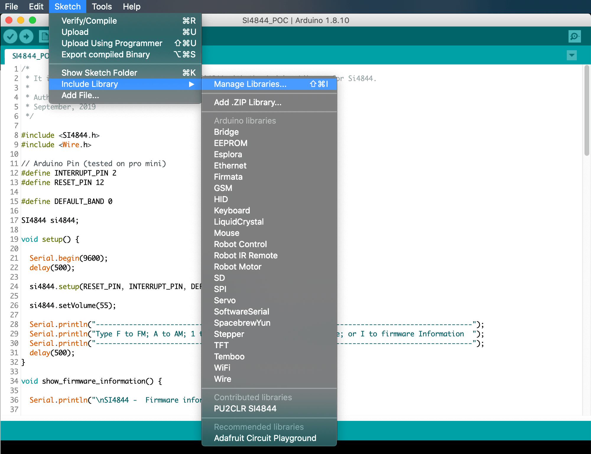
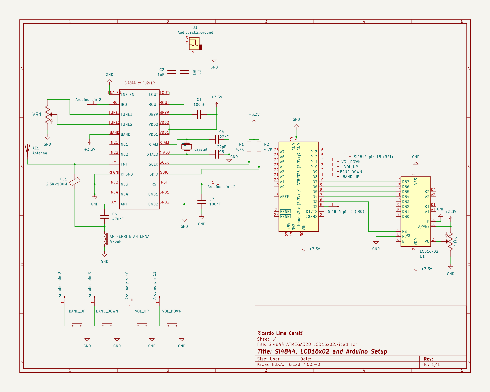

# Si4844 Library for Arduino

[Leia este documento em Português](https://github.com/pu2clr/SI4844/blob/master/README-PT-BR.md)

This is an Arduino library for the SI4844, BROADCAST ANALOG TUNING DIGITAL DISPLAY AM/FM/SW RADIO RECEIVER,  IC from Silicon Labs.  It is available on Arduino IDE. This library is intended to provide an easier interface to control the SI4844.

This library can be freely distributed using the MIT Free Software model. [Copyright (c) 2019 Ricardo Lima Caratti](https://github.com/pu2clr/SI4844#mit-licence)  

Contact: pu2clr@gmail.com

By Ricardo Lima Caratti, Oct 2019. 





## See also 

1. [PU2CLR Si4735 Library for Arduino](https://pu2clr.github.io/SI4735/). Unlike SI4844, the Si4735 has more features and can operate on SSB mode via patch application. This library was built based on “Si47XX PROGRAMMING GUIDE; AN332 ”. It also can be used on all members of the SI47XX family respecting, of course, the features available for each IC version. These functionalities can be seen in the comparison matrix shown in table 1 (Product Family Function); pages 2 and 3 of the programming guide;
2. [PU2CLR AKC695X Arduino Library](https://pu2clr.github.io/AKC695X/). The AKC695X is a family of IC DSP receiver from AKC technology. The AKC6955 and AKC6959sx support AM and FM modes. On AM mode the AKC6955 and AKC6959sx work on LW, MW and SW. On FM mode they work from 64MHz to 222MHz;
3. [PU2CLR KT0915 Arduino Library](https://pu2clr.github.io/KT0915/). The KT0915 is a DSP integrated circuit that provides full band receiver on FM and AM (MW/SW/LW).

__The SI4844 is a 3.3V part. If you are not using a 3.3V version of Arduino, you have to use a kind of 5V to 3.3V converter.__ See [Hardware Requirements and Setup](https://github.com/pu2clr/SI4844#hardware-requirements-and-setup).


## Contents

1. [License Copyright](https://pu2clr.github.io/SI4844/#mit-licence)
2. [Your support is important](https://pu2clr.github.io/SI4844/#your-support-is-important)
3. [About the SI4844 Architecture](https://pu2clr.github.io/SI4844/#about-the-si4844-architecture)
4. [Terminology](https://pu2clr.github.io/SI4844/#terminology)
5. [Labrary Features](https://pu2clr.github.io/SI4844/#library-features)
6. [Library Installation](https://pu2clr.github.io/SI4844/#library-installation)
7. [Hardware Requirements and Setup](https://pu2clr.github.io/SI4844/#hardware-requirements-and-setup)
   * [Schematic](https://pu2clr.github.io/SI4844/#schematic)
   * [Component Parts](https://pu2clr.github.io/SI4844/#parts)
   * [Photos](https://pu2clr.github.io/SI4844/#photos)
8. [API Documentation](https://pu2clr.github.io/SI4844/extras/apidoc/html/)
9. [API Documentation Legacy](https://pu2clr.github.io/SI4844/#api-documentation)
10. [References](https://pu2clr.github.io/SI4844/#references)
11. [Examples](https://pu2clr.github.io/SI4844/#examples)
12. [Videos](https://pu2clr.github.io/SI4844/#videos) 


## MIT License 

Copyright (c) 2019 Ricardo Lima Caratti

Permission is hereby granted, free of charge, to any person obtaining a copy of this software and associated documentation files (the "Software"), to deal in the Software without restriction, including without limitation the rights to use, copy, modify, merge, publish, distribute, sublicense, and/or sell copies of the Software, and to permit persons to whom the Software is furnished to do so, subject to the following conditions:

The above copyright notice and this permission notice shall be included in all copies or substantial portions of the Software.

THE SOFTWARE IS PROVIDED "AS IS", WITHOUT WARRANTY OF ANY KIND, EXPRESS OR IMPLIED, INCLUDING BUT NOT LIMITED TO THE ARRANTIES OF MERCHANTABILITY, FITNESS FOR A PARTICULAR PURPOSE AND NONINFRINGEMENT. IN NO EVENT SHALL THE AUTHORS OR COPYRIGHT HOLDERS BE LIABLE FOR ANY CLAIM, DAMAGES OR OTHER LIABILITY, WHETHER IN AN ACTION OF CONTRACT, TORT OR OTHERWISE, ARISING FROM, OUT OF OR IN CONNECTION WITH THE SOFTWARE OR THE USE OR OTHER DEALINGS IN THE SOFTWARE.


## Your support is important.

If you would like to support this library development, consider joining this project via Github. Alternatively, make suggestions on features you would like available in this library. Thank you!

## About the SI4844 Architecture 

The Si4844 is an analog-tuned digital-display AM/FM/SW radio receiver. It has an analog-tune while frequency, band, and setero/mono information can be displayed on LCD. It works with a I2C protocol that allows a microcontroller send command and receive data.  Also, with a 100K variable resistor, you can simulate a dial mechanical tuning wheel found in old or traditional receiver. In this way, you will be able to offer a look similar to the old radios.

See more about SI4844 on [BROADCAST ANALOG TUNING DIGITAL DISPLAY AM/FM/SW RADIO RECEIVER](https://www.silabs.com/documents/public/data-sheets/Si4840-44-A10.pdf) 


## Terminology

| Term | Description  |
|------|--------|
|Arduino Libraries|Libraries are files written in C or C++ (.c, .cpp) which provide your sketches with extra functionality. The SI4844 Library provides extra functionalities to make easier the Arduino deal with Si4844 device| 
| CTS | Clear to send |
|IDE   |Integrated Development Environment|   
| I²C  | [I²C - Inter-Integrated Circuit](https://pt.wikipedia.org/wiki/I²C)|    
|Sketch|Name that Arduino environment uses for a program|
|ATDD  |Analog Tune Digital Display. Sometimes used to refer the Si4844 device|
|interrupt|In this context, it is a Arduino Resource. Allows important tasks to be performed regardless of the flow of your program|
|C++| A object-oriented programming (OOP) language. It is a superset of the C language with an additional concept of "classes." |
|programming guide| In this context it refers to [Si48XX ATDD PROGRAMMING GUIDE](https://www.silabs.com/documents/public/application-notes/AN610.pdf)|
|POC| Proof of Concept|
| SDIO / SDA | Serial data in/data out pin|
| SCLK / SCL | Serial clock pin |


## Library Features

1. Open Source. It is free. You can use, copy, modify, merge, publish, distribute, sublicense, and/or sell copies of the Software. See [MIT License](https://github.com/pu2clr/SI4844#mit-licence) to know more.   
2. Built Based on [Si48XX ATDD PROGRAMMING GUIDE](https://www.silabs.com/documents/public/application-notes/AN610.pdf)
3. More than 30 Si48XX functions (methods)
4. Extended SW band frequency ranges: 2.3–5.6 MHz and 22–28.5 MHz
5. C++ Lenguage and Object-oriented programming
6. Available on Arduino IDE (Manage Libraries)
7. Simplifies SI4844 based projects


## Library Installation

You can install the library via the Arduino Library Manager. Go to the menu __Sketch__ > __Include Library__ > __Manage Libraries...__, and in the search box,  type __"PU2CLR SI4844"__.

The images below show that actions





You can also download this library or old version of it via this repository or via [Arduino Library List](https://www.arduinolibraries.info/libraries/pu2-clr-si4844).


## Hardware Requirements and Setup

This library has been written for the Arduino platform and has been successfully tested on Pro Mini 3.3V (8MHz). I beleave it will work on any other Arduino with I2C support.


### Arduino 5V and Si4844

__The Si4844 is a 3.3V part. If you are not using a 3.3V version of Arduino, you have to use a kind of 5V to 3.3V bidirectional converter. It is important to say that just power the Si4844 device with 3.3V from Arduino board is not enough. You have to be aware that the Arduino that operates with 5V, the digital pins and the I2C bus will send 5V signals to the Si4844 device. That configuration can make the system unstable or damage the device__.

I have tested it with success the SI4844 with a 5V Arduino using the I2C Multiplexer TCA9548A, that also can work as a bidirectional converter.

See that approach [here](./extras/5V_to_3V3_CONVERTER). 


### Schematic


### Schematic with Arduino Pro Mini 3.3V and OLED

To use this labrary you need to build a radio based on SI4844 connected to Arduino. The schematic and photos below show the hardware and setup requirments for start using this library.


#### Arduino and OLED circuit


#### SI4844 minimal circuit


As you can see above, that is a very simple circuit with minumum component parts. The push button are used with the internal Arduino pull up resistors. The OLED display and the SI4844 are connected on the A4 (SDA) and A5 (SCL) Arduino Pro Mini pins. Pay attention to the I2C bus pull up resistors. This experiment used 10K pull up resistors. However, you can use lower values. 

No front-end was added to this receiver. However, you will be surprised with the its performance. You can connect to the audio output a mono or stereo amplifier or an earphone to listen to the radio. On article [How to Build an Arduino-Controlled AM/FM/SW Radio](https://www.allaboutcircuits.com/projects/build-an-arduino-controlled-am-fm-sw-radio/) [May 26, 2016], Mr. Raymond Genovese, suggests a better SI4844 setup, including a RF amplifier. 

__Another good source is the Silicon Labs Document AN602 "Si4822/26/27/40/44 ANTENNA, SCHEMATIC, LAYOUT, AND DESIGN GUIDELINES" Rev 0.3. This document also suggests better circuits. Check the AN602 pages: 8, 9 and 10__ .    


#### Arduino Pro Mini 3.3V  and SI4844 connections

The table below shows the pin connections between the Si4844 and Arduino Pro Mini.


| SI4844 pin |  Arduino pin |  Description                                       |  
| ---------  | ------------ | -------------------------------------------------  |
|    2       |   2          | Arduino interrupt pin                              |
|   15       |  12          | Regurlar arduino digital pin used to RESET control |
|   16       |  A4 (SDA)    | I2C bus (Data)                                     |
|   17       |  A5 (SCL)    | I2C bus (Clock)                                    | 
  


### Schematic with Arduino Nano 5V and LCD16x02

This circuit uses the Arduino Nano or UNO with SI4844 device. Arduino Nano and the  LCD16x02 operate with 5V.
So, these two devices can be connected direct. However, you need a bi-directonal logic converter to connect the Arduino Nano or UNO to the SI4844 device. The schematic below show the circuit with Arduino Nano 5V and LCD16x02.


See [Bi-Directional Logic Level Converter Hookup Guide ](https://learn.sparkfun.com/tutorials/bi-directional-logic-level-converter-hookup-guide/all) for more details.





__Attention__: If you are not using an Arduino Pro Mini, pay attention to the appropriated Arduino pinout to select the correct interrupt (IRQ), RST, SDIO and  SCLK  pins.  The table below shows some Arduino board pinout. 

|Board | InterrupT (IRQ) Pins| I2C / TWI pins |
|------|---------------------| ---------------|
|328-based <br> (Nano, Mini or Uno) |	D2 and D3 | A4 (SDA/SDIO), A5 (SCL/SCLK) |
| Mega | 2, 3, 18, 19, 20 and  21 | 20 (SDA/SDIO), 21 (SCL/SCLK) |
| 32u4-based <br> (Micro, Leonardo or Yum)	| 0, 1, 2, 3 and 7 | 2 (SDA/SDIO), 3 (SCL/SCLK) |
| Zero | all digital pins except pin 4 | D8 (SDA/SDIO) and D9 (SCL/SCLK)  |
| Due	| all digital pins | 20 (SDA/SDIO), 21 (SCL/SCLK) |
| 101	| all digital pins. <br> Only pins 2, 5, 7, 8, 10, 11, 12, 13 work with CHANGE| |

__Again, pay attention to the operating voltage of the Arduino that you will use. The SI4844 device  works with  +3.3V. See  [Making the Si4844 works with 5V Arduino UNO or similar](https://github.com/pu2clr/SI4844/tree/master/extras/5V_to_3V3_CONVERTER) if you itend to use a 5V Arduino board__.  


### Parts (for OLED and LCD16x02 versions)

Parts list  used by the minimal schematic

|Part	| Description |
|-------  | ------------ |
| IC1	    | Si4844-A10 radio receiver |
| Arduino | Arduino Pro Mini, 3.3V, 8MHz for OLED version or  Nano for LCD16x02 version|
| Bi-Directional module | Only if you are using the Arduino Nano or Uno | 
| C1      |	22pF ceramic capacitor |
| C2      | 22pF ceramic capacitor |
| C3      | 100nF ceramic capacitor |
| C4      | 4.7uF Electrolytic or ceramic capacitor |
| C5      | 4.7uF Electrolytic or ceramic capacitor | 
| C6      | 100nF  ceramic capacitor |
| C7      | 470nF  ceramic capacitor | 
| R1      | 3.3K ~ 10K resistor |
| R2      | 3.3K ~ 10K resistor |
| R3      |	100K linear potentiometer |
| L1    	| ferrite AM antenna | 
| L2      | 100mH |
| Y1      | 32.768 kHz crystal |
| S1...S4 | 4 push buttons |  


### Photos 

### SI4844 soldered on adapter


It was a bit hard to solder the Si4844 on adapter. However, by using a electronic magnifier it was possible.


#### prototyping 


##### Another suggestion


## Playing with Arduino UNO or Pro Mini 5v and SI4844

 During my tests, I have used the __TCA9548A__ as an alternative to regular bi-directional converter on I2C bus. Actually the __TCA9548A__  is an I2C Multiplexer Breakout Board 8 Channel Expansion Board, but you can use it as a bi-directional converter for I2C bus.  Some features:   

1. 1-to-8 Bidirectional Translating Switches 
2. I2C Bus and SMBus Compatible
3. Active-Low Reset Input
4. Three Address Pins, Allowing up to Eight TCA9548A Devices on the I2C Bus
5. Channel Selection Through an I2C Bus, In Any Combination
6. Power Up With All Switch Channels Deselected
7. Low RON Switches
8. __Allows Voltage-Level Translation Between 1.8-V, 2.5-V, 3.3-V, and 5-V Buses__
9.  Supports Hot Insertion
10. Low Standby Current
11. Operating Power-Supply Voltage Range of 1.65 V to 5.5 V
12. 5-V Tolerant Inputs
13. 0- to 400-kHz Clock Frequency
    
You can use a voltage divider for reset (RST) and connect the IRQ direct to the Arduino pin 2 (configures as input).


## API Documentation

### Index 

   * [Defined Data Types and Structures](https://github.com/pu2clr/SI4844#defined-data-types-and-structures)
   * [Public Methods](https://github.com/pu2clr/SI4844#public-methods)
      * [setup](https://github.com/pu2clr/SI4844#setup)
      * [reset](https://github.com/pu2clr/SI4844#reset)
      * [powerDown](https://github.com/pu2clr/SI4844#powerdown)
      * [setBand](https://github.com/pu2clr/SI4844#setband)
      * [setCustomBand](https://github.com/pu2clr/SI4844#setCustomBand)
      * [changeVolume](https://github.com/pu2clr/SI4844#changevolume)
      * [setVolume](https://github.com/pu2clr/SI4844#setvolume)
      * [volumeUp](https://github.com/pu2clr/SI4844#volumeup)
      * [volumeDown](https://github.com/pu2clr/SI4844#volumedown)
      * [setAudioMode](https://github.com/pu2clr/SI4844#setaudiomode)
      * [setAudioMute](https://github.com/pu2clr/SI4844#setaudiomute)
      * [getStatus](https://github.com/pu2clr/SI4844#getstatus)
      * [getFirmware](https://github.com/pu2clr/SI4844#getfirmware)
      * [getFrequency](https://github.com/pu2clr/SI4844#getfrequency)
      * [hasStatusChanged](https://github.com/pu2clr/SI4844#hasstatuschanged)  
      * [resetStatus](https://github.com/pu2clr/SI4844#resetstatus)
      * [getBandMode](https://github.com/pu2clr/SI4844#getbandmode)
      * [getStereoIndicator](https://github.com/pu2clr/SI4844#getstereoindicator)
      * [getStatusBCFG0](https://github.com/pu2clr/SI4844#getstatusbcfg0)
      * [getStatusBCFG1](https://github.com/pu2clr/SI4844#getstatusbcfg1)
      * [getStatusStereo](https://github.com/pu2clr/SI4844#getstatusstereo)
      * [getStatusStationIndicator](https://github.com/pu2clr/SI4844#getstatusstationindicator)
      * [getStatusInformationReady](https://github.com/pu2clr/SI4844#getstatusinformationready)
      * [getStatusHostPowerUp](https://github.com/pu2clr/SI4844#getstatushostpowerup)
      * [getStatusHostReset](https://github.com/pu2clr/SI4844#getstatushostreset)
      * [getStatusBandMode](https://github.com/pu2clr/SI4844#getstatusbandmode)
      * [getStatusBandIndex](https://github.com/pu2clr/SI4844#getstatusbandindex)
      * [getStatusCTS](https://github.com/pu2clr/SI4844#getstatuscts)
      * [getFirmwareErr](https://github.com/pu2clr/SI4844#getfirmwareerr)
      * [getFirmwareCTS](https://github.com/pu2clr/SI4844#getfirmwarects)
      * [getFirmwarePartNumber](https://github.com/pu2clr/SI4844#getfirmwarepartnumber)
      * [getFirmwareMajorRevision](https://github.com/pu2clr/SI4844#getfirmwaremajorrevision)
      * [getFirmwareMinorRevision](https://github.com/pu2clr/SI4844#getfirmwareminorrevision)
      * [getFirmwareComponentMajorRevision](https://github.com/pu2clr/SI4844#getfirmwarecomponentmajorrevision)
      * [getFirmwareComponentMinorRevision](https://github.com/pu2clr/SI4844#getfirmwarecomponentminorrevision)
      * [getFirmwareChipRevision](https://github.com/pu2clr/SI4844#getfirmwarechiprevision) 


This labrary was developed in C++.  To use it, you must declare in your Sketch a variable of the class SI4844.
The code below shows that. 

```cpp
#include <SI4844.h>

// Arduino Pin (tested on pro mini)
#define INTERRUPT_PIN 2
#define RESET_PIN 12


#define DEFAULT_BAND 4

SI4844 si4844; 

void setup() {

    // Initiate and connect the device ATDD (SI4844) to Arduino
    si4844.setup(RESET_PIN, INTERRUPT_PIN, DEFAULT_BAND);

}

void loop() {

  // if something changed on ATDD (SI4844), do something  
  if (si4844.hasStatusChanged())
  {
    Serial.print("Band Index: ");
    Serial.print(si4844.getStatusBandIndex());
    Serial.print(" - ");
    Serial.print(si4844.getBandMode());
    Serial.print(" - Frequency: ");    
    Serial.print(si4844.getFrequency(),0);
    Serial.print(" KHz");
    Serial.print(" - Stereo ");
    Serial.println(si4844.getStereoIndicator());
  }

}
```

See [Proof of Concept for SI4844 Arduino Library](https://github.com/pu2clr/SI4844/tree/master/examples/SI4844_POC) to get the entire exemple. 


### Defined Data Types and Structures

To make the SI4844 device easier to deal, some defined data types were built to handle byte and bits responses.

```cpp
/* 
 * The structure below represents the four bytes response got by command ATDD_GET_STATUS
 * See Si48XX ATDD PROGRAMMING GUIDE, pages 14 and 15
 */
typedef struct
{
  byte BCFG0 : 1;     // Bit 0
  byte BCFG1 : 1;     // bit 1
  byte STEREO : 1;    // bit 2
  byte STATION : 1;   // bit 3
  byte INFORDY : 1;   // bit 4
  byte HOSTPWRUP : 1; // bit 5
  byte HOSTRST : 1;   // bit 6
  byte CTS : 1;       // bit 7
  byte BANDIDX : 6;   // Form bit 0 to 5
  byte BANDMODE : 2;  // From bit 6 to 7
  byte d2 : 4;        // Frequency digit 2
  byte d1 : 4;        // Frequency digit 1
  byte d4 : 4;        // Frequency digit 4
  byte d3 : 4;        // frequency digit 3
} si4844_get_status;
```


```cpp
/*
 * Uses a C language feature to represent two way for the 4 response bytes (status) sent by the ATDD_GET_STATUS.
 * It is needed to undertand the C language union concept.
 * See Si48XX ATDD PROGRAMMING GUIDE, pages 14 and 15 
*/
typedef union {
  si4844_get_status refined;
  byte raw[4];
} si4844_status_response;
```


```cpp
// English:
// GET_REV structure. The structure below represents 9 bytes response for GET_REV command.
// STATUS and RESP1 to RESP8.  See Si48XX ATDD PROGRAMMING GUIDE; AN610, page 22.
// Portuguese:
typedef struct
{
  byte RESERVED : 6; // Bit 0 to 5
  byte ERR : 1;      // bit 6
  byte CTS : 1;      // bit 2
  byte PN;           // Final 2 digits of Part Number (HEX).
  byte FWMAJOR;      // Firmware Major Revision (ASCII).
  byte FWMINOR;      // Firmware Minor Revision (ASCII).
  byte CMPMAJOR;     // Component Major Revision (ASCII).
  byte CMPMINOR;     // Component Minor Revision (ASCII).
  byte CHIPREV;      // Chip Revision (ASCII).
} si4844_firmware_info;
```


```cpp
typedef union {
  si4844_firmware_info refined;
  byte raw[9];
} si4844_firmware_response;
```


### Public Methods


#### setup

```cpp
/*
* Initiate the SI4844 instance and connect the device (SI4844) to Arduino. 
* Calling this library should be the first thing to do to control the SI4844.
*
* @param resetPin  arduino pin used to reset the device
* @param interruprPin arduino pin used to handle interrupr      
* @param defaultBand band that the radio should start
*/
void setup(unsigned int, unsigned int, byte)
```
Example:
```cpp
  si4844.setup(12, 2, 4);
```

#### reset

```cpp
/*
 * reset
 * English
 * See pages 7, 8, 9 and 10 of the programming guide.
 */
void reset(void )
```
Example:
```cpp
  si4844.reset();
```


### powerDown

```cpp
/*
 * Moves the device from power up to power down mode. 
 * See Si48XX ATDD PROGRAMMING GUIDE; AN610; page 45
 */
void SI4844::powerDown(void)
```


#### setBand

```cpp
/*
 * Set the radio to a new band. 
 * See Table 8. Pre-defined Band Table in Si48XX ATDD PROGRAMMING GUIDE; AN610; pages 17 and 18  
 */
void setBand(byte);
```

Example:
```cpp
  si4844.setBand(4); // FM
```

#### setCustomBand

```cpp
/* 
 * This method allows you to customize the frequency range of a band.
 * The SI4844 can work from 2.3–28.5 MHz on SW, 64.0–109.0 MHz on FM
 * You can configure the band index 40, for example, to work between 27 to 28 MHz.
 * See Si48XX ATDD PROGRAMMING GUIDE, pages 17, 18, 19 and 20.
 * 
 * (top – button)/(bandSpace) must be betwenn 50 and 230
 * 
 * @param byte bandIndes; Predefined band index (valid values: betwenn 0 and 40)
 * @param unsigned button; Band Bottom Frequency Limit
 * @param unsigned top; Band Top Frequency Limit
 * @param byte bandSpace; Channel Spacing (use 5 or 10 - On FM 10 = 100KHz)
 * @return void
 */
void SI4844::setCustomBand(byte, unsigned, unsigned, byte ) 
```
Example: 

```cpp
SI4844 si4844; 

void setup() {
  Serial.begin(9600);
  delay(500);  
  si4844.setup(RESET_PIN, INTERRUPT_PIN, DEFAULT_BAND);
  // Configure the Pre-defined Band (band index 40) to work between 27.0 to 27.5 MHz
  // See Si48XX ATDD PROGRAMMING GUIDE, pages 17,18,19 and 20.
  si4844.setCustomBand(40,27000,27500,5);  

}
```


#### changeVolume

```cpp
/*
 *  Up or down the sound volume level/  
 *  @param char '+' up and '-' down 
 */
void changeVolume(char);
```

Example:
```cpp
  si4844.changeVolume('+'); 
```

#### setVolume

```cpp
/*
 * Set the sound volume level. 
 * @param byte volumeLevel (domain: 0 to 63) 
 */
setVolume(byte level)
```

Example:
```cpp 
  si4844.setVolume(55);
```

### volumeUp

```cpp
/*
 *  Set sound volume level Up   
 *  
 */
void SI4844::volumeUp()
```

Example:
```cpp 
  si4844.volumeUp();
```


### volumeDown

```cpp
/*
 *  Set sound volume level Down   
 *  
 */
void SI4844::volumeDown()
```

Example:
```cpp 
  si4844.volumeDown();
```


### setAudioMode

```cpp
/*
 * Set audio mode 
 * See Si48XX ATDD PROGRAMMING GUIDE; AN610; page 21
 * @param byte audio_mode 
 *             0 = Digital volume mode (no bass/treble effect, volume levels from 0 to 63) 
 *             1 = Bass/treble mode (no digital volume control, fixed volume level at 59)
 *             2 = Mixed mode 1 (bass/treble and digital volume coexist, max volume = 59) 
 *             3 = Mixed mode 2 (bass/treble and digital volume coexist, max volume = 63) 
 *             Default is 3 (Mixed mode 2)
 * @param byte opcode 
 *             0 = Set audio mode and settings
 *             1 = Get current audio mode and settings without setting
 * @param byte attenuation (0 => -2db; 1 => 0db)
 */
void setAudioMode(byte opcode, byte attenuation )
```

Example:
```cpp 
  si4844.setAudioMode(1,1);
```


### setAudioMute

```cpp
/*
 * Mutes the audio output.
 * 
 * @param bool on - false = normal (no mute); true = mute 
 */
void setAudioMute(bool on)
```


### setBassTreeble


```cpp
/*
 * Set bass and treeble. 
 * @param byte bass and treeble (domain: 0 to 8)
 *      0 -Bass boost +4 (max)
 *      1- Bass boost +3
 *      2- Bass boost +2
 *      3- Bass boost +1 (min)
 *      4- Normal (No Bass/Treble effect) (Default) 5- Treble boost +1 (min)
 *      6- Treble boost +2
 *      7- Treble boost +3
 *      8- Treble boost +4 (max)
 */
void setBassTreeble(byte bass_treeble) {
```

Example:
```cpp 
  si4844.setBassTreeble(2);
```


#### getStatus

```cpp 
/*
 * Get tune freq, band, and others information, status of the device.
 * Use this method only if you want to deal with that information by yourself. 
 * This library has other methods to get that information easier. 
 * 
 * @return a pointer to a structure type si4844_status_response
 */
si4844_status_response *getStatus(void);
```
Example:
```cpp 
  si4844.getStatus();
```

#### getFirmware

```cpp
/*
 * Get part number, chip revision, firmware, patch, and component revision numbers.
 * You do not need to call this method. It is executed just once at setup methos. 
 * There are other methods that give you that information.   
 * See page 22 of programming guide.
 * 
 * @return a pointer to a structure type  with the part number, chip revision, 
 *         firmware revision, patch revision, and component revision numbers.
 */
si4844_firmware_response *getFirmware(void);
```
Example:
```cpp 
  si4844.getFirmware();
```

#### getFrequency

```cpp
/*
 * Get the current frequency of the radio in KHz. 
 * For example: FM, 103900 KHz (103.9 MHz);
 *              SW, 7335 KHz (7.34 MHz, 41m)   
 * 
 * @return float current frequency in KHz.  
 */
float getFrequency(void);
```

Example:
```cpp 
    Serial.print("Frequency: ");    
    Serial.print(si4844.getFrequency(),0);
```

#### hasStatusChanged

```cpp
/*
*  Check if the SI4844 has its status changed. If you move the tuner, for example,
*  the status of the device is changed. 
*
*  return true or false  
*/
bool hasStatusChanged(void);
```

Example:
```cpp 
  if (si4844.hasStatusChanged())
  {
    Serial.print(" - Frequency: ");    
    Serial.print(si4844.getFrequency(),0);
    Serial.print(" KHz");
    Serial.print(" - Stereo ");
    Serial.println(si4844.getStereoIndicator());
  }
```

#### resetStatus

```cpp
/*
 * Set the control variable to default status
 */
void resetStatus(void);
```


#### getBandMode

```cpp
/*
 * Get te current band(FM/AM/SW)
 * @return char * "FM", "AM" or "SW".
 */ 
inline String getBandMode()
```

#### getStereoIndicator

```cpp
/*
 * Get a string (char *) On or Off indicating stereo situation. 
 * return char * "On" or "Off"
 */
inline String getStereoIndicator()
```

#### getStatusBCFG0

```cpp
/*
 * See Si48XX ATDD PROGRAMMING GUIDE, AN610, pages 15 and 16
 */
inline unsigned getStatusBCFG0() 
```

#### getStatusBCFG1

```cpp
/*
 * See Si48XX ATDD PROGRAMMING GUIDE, AN610, pages 15 and 16
 */
inline unsigned getStatusBCFG1() 
```

#### getStatusStereo

```cpp
/*
 * Return a integer indicating the stereo status (0 = Off and 1 = On).
 * See Si48XX ATDD PROGRAMMING GUIDE, AN610, pages 15 and 16
 */
inline unsigned getStatusStereo() 
```


#### getStatusStationIndicator

```cpp
/*
 * See Si48XX ATDD PROGRAMMING GUIDE, AN610, pages 15 and 16
 */
inline unsigned getStatusStationIndicator() 
```


#### getStatusInformationReady

```cpp
/*
 * See Si48XX ATDD PROGRAMMING GUIDE, AN610, pages 15 and 16
 */
inline unsigned getStatusInformationReady() 
```


#### getStatusHostPowerUp
```cpp
/*
 * See Si48XX ATDD PROGRAMMING GUIDE, AN610, pages 15 and 16
 */
inline unsigned getStatusHostPowerUp() 
```

#### getStatusHostReset

```cpp
/*
 * See Si48XX ATDD PROGRAMMING GUID, AN610, pages 15 and 16
 */
inline unsigned getStatusHostReset() 
```


#### getStatusBandMode

```cpp
/*
 * Return an integer (0 - FM; 1 = AM and 2 = SW) 
 * See Si48XX ATDD PROGRAMMING GUIDE, AN610, pages 15 and 16
 */
inline unsigned getStatusBandMode() 
```

#### getStatusBandIndex

```cpp
/*
 * return an integer with the currente band index in use. 
 * Set Table 13. Pre-defined Band Table in Si48XX ATDD PROGRAMMING GUID, AN610, pages 39 and 40
 */
inline unsigned getStatusBandIndex() 
```

#### getStatusCTS

```cpp
/*
 * See Si48XX ATDD PROGRAMMING GUIDE, AN610, pages 15 and 16
 */
inline unsigned getStatusCTS() 
```


#### getFirmwareErr

```cpp 
inline unsigned getFirmwareErr()
```

#### getFirmwareCTS
```cpp
inline unsigned getFirmwareCTS()
```

#### getFirmwarePartNumber

```cpp
/*
 * Get Firmware Final 2 digits of Part Number (HEX).
 */ 
inline unsigned getFirmwarePartNumber() 
```
__See example below__


#### getFirmwareMajorRevision

```cpp
/*
 * Get Firmware Major Revision (ASCII).
 */ 
inline unsigned getFirmwareMajorRevision() 
```
__See example below__


#### getFirmwareMinorRevision

```cpp
/*
 * Get Firmware Minor Revision (ASCII).
 */
inline unsigned getFirmwareMinorRevision() 
```
__See example below__


#### getFirmwareComponentMajorRevision

```cpp
/*
 * Get Firmware Component Major Revision (ASCII).
 */ 
inline unsigned getFirmwareComponentMajorRevision() 
```
__See example below__


#### getFirmwareComponentMinorRevision

```cpp
/* 
 * Get Firmware Component Minor Revision (ASCII).
 */
inline unsigned getFirmwareComponentMinorRevision() 
```
__See example below__


#### getFirmwareChipRevision

```cpp
/*
 * Chip Revision (ASCII).
 */
inline unsigned getFirmwareChipRevision() 
```

Example:

```cpp

  Serial.println("\nSI4844 -  Firmware information\n");

  si4844.getFirmware();
  Serial.print("Final 2 digits of Part Number..: ");
  Serial.println(si4844.getFirmwarePartNumber());
  Serial.print("Firmware Major Revision........: ");
  Serial.println(si4844.getFirmwareMajorRevision());
  Serial.print("Firmware Minor Revision........: ");
  Serial.println(si4844.getFirmwareMinorRevision());
  Serial.print("Component Major Revision.......: ");
  Serial.println(si4844.getFirmwareComponentMajorRevision());
  Serial.print("Component Minor Revision.......: "); 
  Serial.println(si4844.getFirmwareComponentMinorRevision());
  Serial.print("Chip Revision..................: ");
  Serial.println(si4844.getFirmwareChipRevision());

  Serial.println("*****************************");
  ```


## References

1. [Si48XX ATDD PROGRAMMING GUIDE](https://www.silabs.com/documents/public/application-notes/AN610.pdf)
2. [BROADCAST ANALOG TUNING DIGITAL DISPLAY AM/FM/SW RADIO RECEIVER](https://www.silabs.com/documents/public/data-sheets/Si4840-44-A10.pdf)
3. [Si4822/26/27/40/44 ANTENNA, SCHEMATIC, LAYOUT, AND DESIGN GUIDELINES](https://www.silabs.com/documents/public/application-notes/AN602.pdf)
4. [How to Build an Arduino-Controlled AM/FM/SW Radio](https://www.allaboutcircuits.com/projects/build-an-arduino-controlled-am-fm-sw-radio/)
5. [I2C bi-directional level shifter](https://playground.arduino.cc/Main/I2CBi-directionalLevelShifter/)
6. [Making the Si4844 works with 5V Arduino UNO or similar](https://github.com/pu2clr/SI4844/tree/master/extras/5V_to_3V3_CONVERTER)


## Examples

In [examples folder](https://github.com/pu2clr/SI4844/tree/master/examples) you will find some sketches that might help you in your project.

### Firmware Information

The [SI4844_FIRMWARE.ino](https://github.com/pu2clr/SI4844/blob/master/examples/SI4844_FIRMWARE/SI4844_FIRMWARE.ino) start the radio on FM Band and shows the SI4844 firmware information.


### Minimal Radio with SI4844 (SI4844_MINIMAL)

The [SI4844_MINIMAL.ino](https://github.com/pu2clr/SI4844/blob/master/examples/SI4844_00_MINIMAL/SI4844_00_MINIMAL.ino) is a sketch with just 35 lines. It is enough to make a simple radio based on SI4844.  


### Proof of Concept

The [SI4844_POC.ino](https://github.com/pu2clr/SI4844/blob/master/examples/SI4844_00_POC/SI4844_00_POC.ino) is a proof of concept for SI4844 controlled by Arduino and the SI4844 Library. This Arduino Sketch only works on your IDE (Arduino IDE). However, you can replace the Serial Monitor functions that deal the SI4844 and arduino with functions that will manipulate the LCD, encoder and push buttons appropriated for your project.  

### Extended SW band frequency ranges from 2.3–5.6 MHz and 22–28.5 MHz 

The sketch [SI4844_CUSTOM_BAND.ino](https://github.com/pu2clr/SI4844/blob/master/examples/TEST/SI4844_CUSTOM_BAND/SI4844_CUSTOM_BAND.ino) shows how to extend a SW band frequency ranges. You can define band from from 2.3–5.6 MHz and 22–28.5 MHz. 


## SI4844 with OLED and buttons

The sketch [SI4844_01_OLED.ino](https://github.com/pu2clr/SI4844/tree/master/examples/SI4844_01_OLED) shows an example of using an I2C OLED display.

The schematic below shows how to insert the OLED and button on the original schematic. 


## SI4844 with Nano and LCD16x02

The sketch [SI4844_02_LCD16x02.ino](https://github.com/pu2clr/SI4844/tree/master/examples/SI4844_02_LCD16x02) shows an example of using the traditional LCD16x02.

The schematic below shows the circuit used with this sketch.


## Sound Control

The sketch [SI4844_BASS_TREBLE.ino](https://github.com/pu2clr/SI4844/tree/master/examples/SI4844_BASS_TREBLE) shows how to use sound control (treble, bass, mute etc).
   

## Videos

1. [Biblioteca Arduino para o Rádio SI4844 FM AM SW da Silicon Labs](https://youtu.be/ZRDuRV25zmY)
2. [Prova de Conceito com SI4844 e Arduino (vídeo sobre este projeto)](https://youtu.be/DAQbXZZR7VQ)

