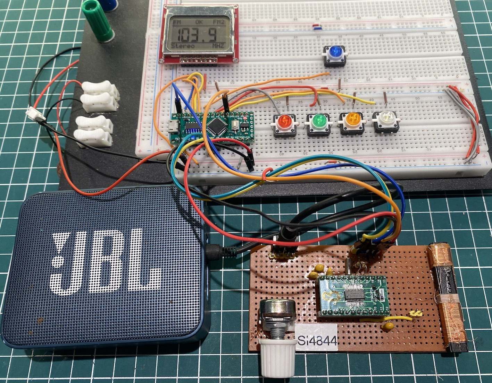
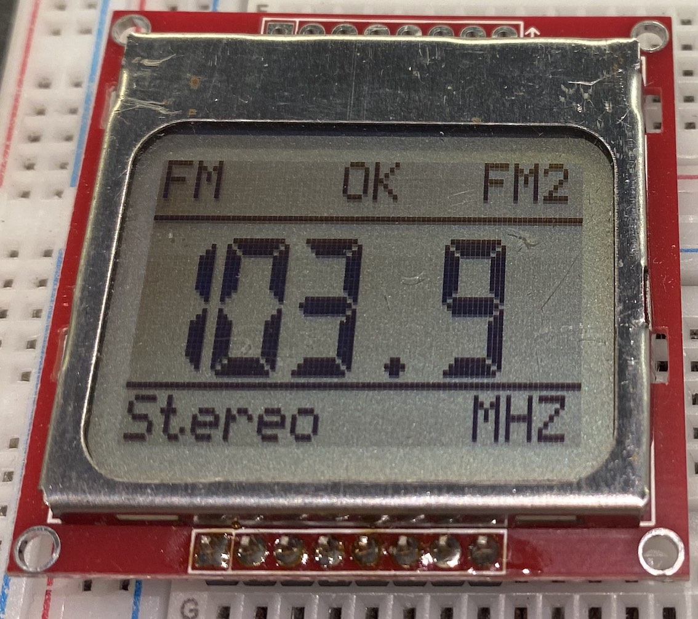
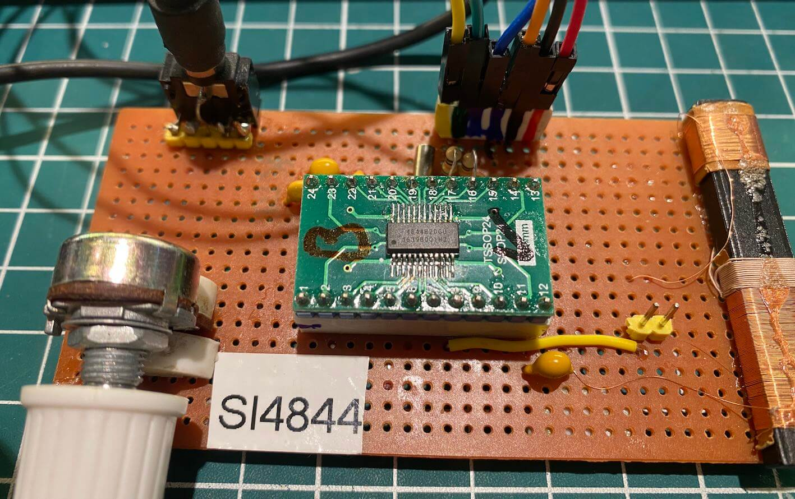
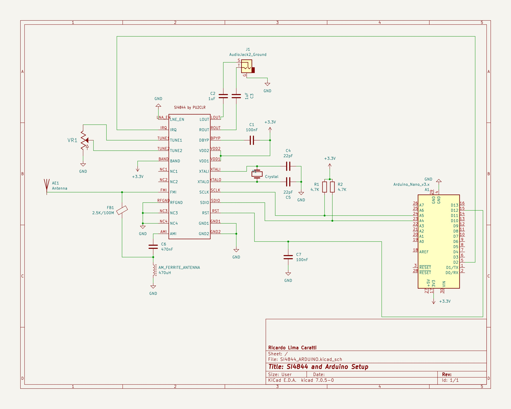
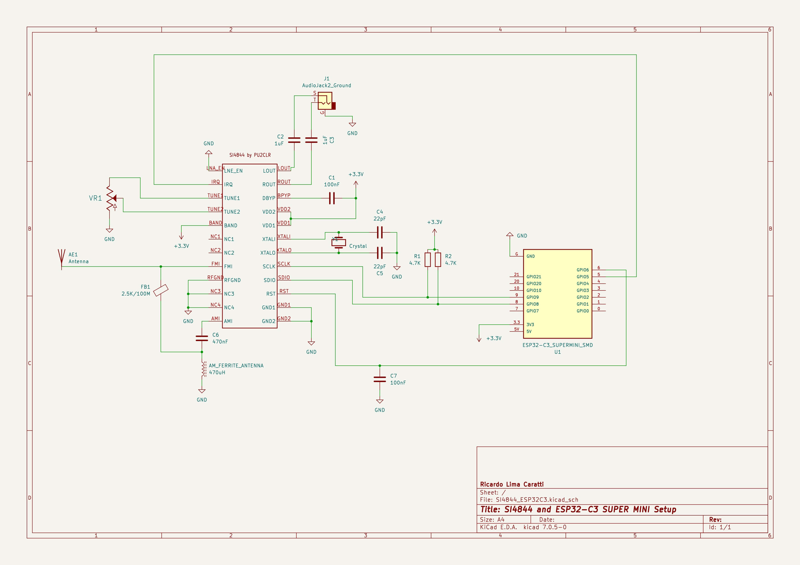
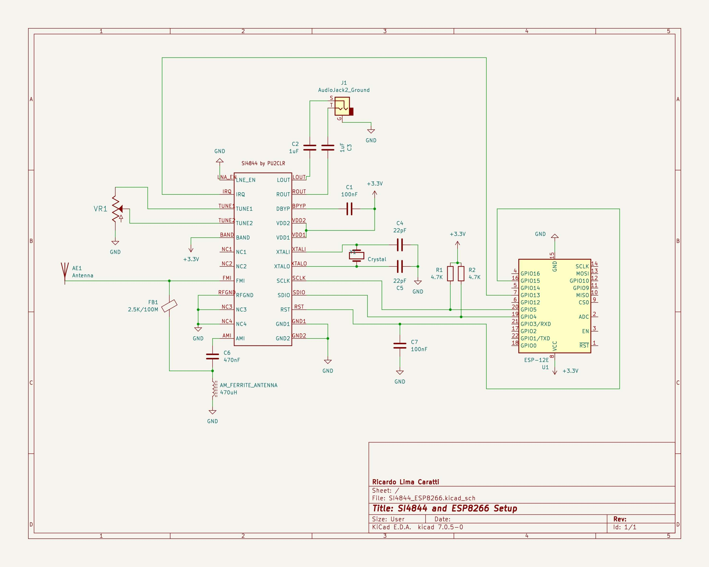
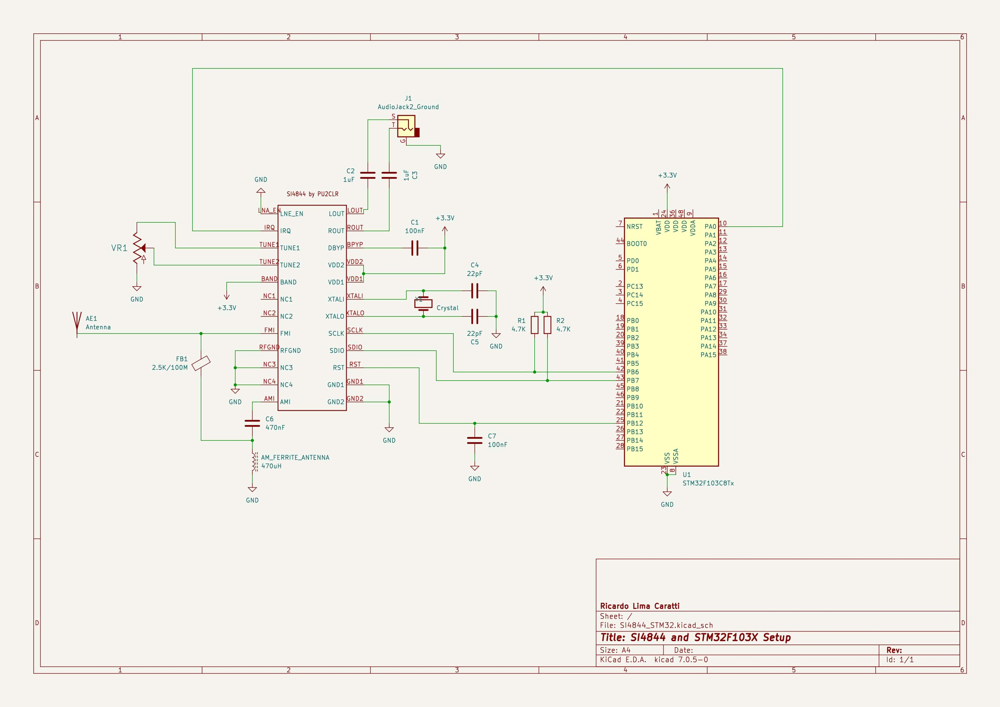

# Examples of using the SI4844 Library for Arduino

This folder has a set of examples that might help you in your project with Si4844 and Arduino.

__This project is about a library to control the SI4844 device and the focus of this project is the library and its functionalities. Please, don't ask me to assist you in your: displays (LCD, OLED, TFT etc), encoders, buttons or something else out the library scope. Thanks.__

## Minimal Radio with SI4844 (SI4844_MINIMAL)

The [SI4844_00_MINIMAL.ino](./SI4844_00_MINIMAL/SI4844_00_MINIMAL.ino) is a sketch with just 35 lines. It is enough to make a simple radio based on SI4844.  

## Proof of Concept

The [SI4844_00_POC.ino](./SI4844_00_POC/SI4844_00_POC.ino) is a proof of concept for SI4844 controlled by Arduino and the SI4844 Library. This Arduino Sketch only works on your IDE (Arduino IDE). However, you can replace the Serial Monitor functions that deal the SI4844 and arduino with functions that will manipulate the LCD, encoder and push buttons appropriated for your project.  

## Extended SW band frequency ranges from 2.3–5.6 MHz and 22–28.5 MHz 

The sketch [SI4844_CUSTOM_BAND.ino](./TEST/SI4844_CUSTOM_BAND/SI4844_CUSTOM_BAND.ino) shows how to extend a SW band frequency ranges. You can define band from from 2.3–5.6 MHz and 22–28.5 MHz. 

## Donate 

If you find this project useful, consider making a donation so that the author of this library can purchase components and modules for improvements and testing of this library. [Click here to donate.](https://www.paypal.com/donate/?business=LLV4PHKTXC4JW&no_recurring=0&item_name=Consider+making+a+donation.++So+I+can+purchase+components+and+modules+for+improvements+and+testing+of+this+library.&currency_code=USD)

## SI4844 with OLED

The sketch [SI4844_01_OLED.ino](https://github.com/pu2clr/SI4844/tree/master/examples/SI4844_01_OLED) shows an example of using an I2C OLED display. __This sketch uses the SSD1306Ascii Arduino Library by Bill Greiman__. You must install SSD1306Ascii via Manage Libraries on your Arduino IDE.

The schematics below show how to add the OLED and buttons. 

#### Arduino and OLED circuit

The table below shows the pin connections between the Si4844 and Arduino Pro Mini.

| SI4844 pin |  Arduino pin |  Description                                       |  
| ---------  | ------------ | -------------------------------------------------  |
|    2       |   2          | Arduino interrupt pin                              |
|   15       |  12          | Regurlar arduino digital pin used to RESET control |
|   16       |  A4 (SDA)    | I2C bus (Data)                                     |
|   17       |  A5 (SCL)    | I2C bus (Clock)                                    | 

|   OLED     | Arduino pin  |                                                    
| -----------| -------------|                       
|    SDA     |  A4          | 
|    CLK     |  D5          | 

| Buttons    | Arduino pin  |                 
| -----------| -------------|
|  BAND_UP   |     8        |                          
|  BAND_DOWN |     9        | 
|  VOL_UP    |    10        | 
|  VOL_DOWN  |    11        |  

#### SI4844 minimal circuit

### Schematic with Arduino Nano 5V and LCD16x02

This circuit uses the Arduino Nano or UNO, LCD16-02 with SI4844 device. Arduino Nano and the  LCD16x02 operate with 5V. So, these two devices can be connected direct. However, __you need a bi-directonal logic converter to connect the Arduino Nano or UNO to the SI4844 device__. The schematic below show the circuit with Arduino Nano 5V and LCD16x02.
You can use the SI4844 minimal circuit as SI4844 setup reference.

#### The schematic below shows a suggestion to the bi-directional converter strategy.

See also: [Bi-Directional Logic Level Converter Hookup Guide ](https://learn.sparkfun.com/tutorials/bi-directional-logic-level-converter-hookup-guide/all) for more details.

#### Arduino Nano, LCD16x02, Push Buttons and SI4844 pin connections
 
 
| SI4844 pin |  Arduino pin |  Description                                       |
| ---------  | ------------ | -------------------------------------------------  |
|    2       |   2          | Arduino interrupt pin                              |
|   15       |   12         | Arduino A0 (Digital pin 14) for SI4844 RESET       |
|   16       |  A4 (SDA)    | I2C bus (Data)                                     |
|   17       |  A5 (SCL)    | I2C bus (Clock)                                    | 

|  LCD 16x02 | Arduino pin  |                                                    |
| -----------| -------------| ---------------------------------------------------|                        
|      D4    |     D7       | Arduino Digital Pin 7                              |
|      D5    |     D6       | Arduino Digital Pin 6                              | 
|      D6    |     D5       | Arduino Digital pin 5                              |
|      D7    |     D4       | Arduino Digital Pin 4                              | 
|      RS    |     D3       | Arduino Digital Pin 3 for LCD RESET controle       | 
|      E/ENA |     D13      | Arduino Digital Pin 13                             |
|RW & VSS & K|     GND      |                                                    |
| A & VDD    |    +Vcc      |                                                    |
|      VO    |              | (see 10K tripot connection)                        |

| Buttons    | Arduino pin  |                 
| -----------| -------------|
|  BAND_UP   |     8        |                          
|  BAND_DOWN |     9        | 
|  VOL_UP    |    10        | 
|  VOL_DOWN  |    11        |  

#### Arduino Uno/Nano (Atmega328 or LGT8F328), Nokia 5110 Display and SI4844 pin connections

The Nokia 5110 display is widely used in Arduino experiments. It is generally available at a low cost and supported by numerous libraries for control. The following prototype demonstrates an example of a receiver based on the SI4844, utilizing the Nokia 5110 display along with 5 buttons to control the receiver. With this interface, you can select 2 FM bands, 2 AM bands, and 9 SW bands. You can also modify the sketch to include additional bands or adjust the lower and upper frequency limits for each band. It is possible to control the audio using three buttons (Volume, Bass, and Treble).

##### Nokia 5110 Display and SI4844 prototype

Note: In this prototype, the FM bands have been configured to be narrower than those typically found in commercial receivers. This approach was adopted to enhance the tuning experience. By narrowing the bands, it became easier to tune a station using a 100K potentiometer, which offers only 180 degrees of rotation. Commercial receivers usually employ mechanical reduction systems, such as pulleys or gears, to improve  the user experience by providing finer tuning control. Since this prototype lacks such mechanical aids, I chose to narrow the bands to compensate and optimize usability.

##### Wire up on ATmega328 or Arduino Pro Mini or  Nano or  LGT8F328  and SI4844 and Nokia Diaplay

  |     Device name       | Device Pin / Description      |  Arduino Pin  |
  | --------------------- | ----------------------------- | ------------  |
  |   Display NOKIA 5110  |                               |               |
  |                       | (1) RST (RESET)               |     8         |
  |                       | (2) CE or CS                  |     9         |
  |                       | (3) DC or DO                  |    10         |
  |                       | (4) DIN or DI or MOSI         |    11         |
  |                       | (5) CLK                       |    13         |
  |                       | (6) VCC  (3V-5V)              |    +VCC       |
  |                       | (7) BL/DL/LIGHT               |    +VCC       |
  |                       | (8) GND                       |    GND        |
  |    SI4844             |                               |               |
  |                       | RESET (pin 15)                |     12        |
  |                       | INTERRUPT (pin 2)             |      2        |
  |                       | SDA (pin 16)                  |     A4        |
  |                       | SCL (pin 17)                  |     A5        |
  |    Buttons            |                               |               |
  |                       | Band + (Next Band)            |      3        |
  |                       | Band - (Previous Band)        |      4        |
  |                       | Vol/Bass/Treble +             |      5        |
  |                       | Vol/Bass/Treble -             |      6        | 
  |                       | Toggle Vol/bass/treble        |      7        |    

## Sound Control

The sketch [SI4844_BASS_TREBLE.ino](https://github.com/pu2clr/SI4844/tree/master/examples/SI4844_BASS_TREBLE) show how to use sound control (treble, bass, mute etc).

## SHEMATICS

### SI4844 AND ARDUINO SETUP

### SI4844 AND ESP32-C3 SETUP

### SI4844 AND ESP8266 SETUP

### SI4844 AND STM32F103X SETUP

