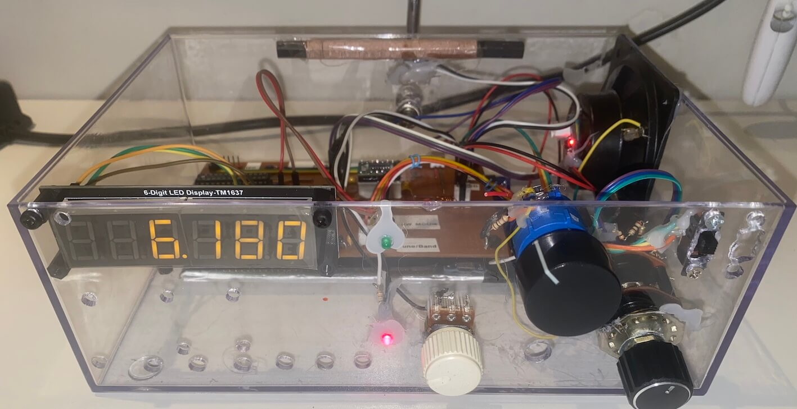

# SLIDE SWITCH EXAMPLE


The Si48XX IC family (Si4822/26/27/40/44) offers two methods for band selection:  

1. The microcontroller sends commands to the Si48XX to change the band when triggered by the user, typically via a pushbutton.  
2. The user selects the band manually using a mechanical band selector (such as a slide switch or rotary switch), and the Si48XX detects this change and notifies the microcontroller.  

This section focuses on the second method, where a mechanical band selector, consisting of a resistor network (voltage divider), determines the active band at any given time.  


   
## Hardware Configuration**  

Unlike the version where the microcontroller handles band selection, the version where the Si48XX device detects the band via a mechanical selector requires some circuit modifications:  

1. **Building the Band Selector:** The selector must be constructed with the correct resistor values to achieve the desired bands. This step is arguably the most labor-intensive in this approach.  
2. **Connecting the BAND Pin:** In the microcontroller-controlled version, the BAND pin is connected to +VCC. However, in the mechanical selection version, it must be connected to the central pin of the band selector.  

The circuit diagram below illustrates this configuration.  


SOURCE: Si4844-B DEMO BOARD USER ’S GUIDE


The previous diagram was created based on the document **"Si4844-B DEMO BOARD USER’S GUIDE"** and allows the selection of 12 bands, consisting of two FM bands, two AM bands, and eight Shortwave (SW) bands. The table below illustrates the coverage range for each band.  


| Band Name  | Narrow Frequency Range  | Wide Frequency Range   |
| ---------- | ------------------------| ---------------------- |
| FM1        | 87-108 MHz              | 64-108 MHZ             |
| FM5        | 64-87  MHz              | 76-108 MHZ             |
| AM1        | 520-1710 KHZ            | ------------           |
| AM2        | 522-1620 KHZ            | ------------           |
| SW1        | 5.6-6.4 MHz             | 3.2-7.6 MHz            |
| SW3        | 6.8-7.6 MHz             | 3.2-100 MHz            |
| SW5        | 9.2.4-10.0 MHz          | 5.9-18.0 MHz           |
| SW7        | 11.45-12.25 MHz         | 7.0-16.0 MHz           |
| SW9        | 13.4-14.2 MHz           | 7.0-23.0 MHz           |
| SW11       | 15.0-15.9 MHz           | 9.0-22.0 MHz           |
| SW13       | 17.1-18.0 MHz           | 9.5-18.0 MHz           |
| SW15       | 21.2-22.00 MHz          | 10.0-22.5 MHz          |

SOURCE SI4844 DEMO BOARD USER'S GUIDE


***It is important to note that on the Si48XX, the coverage range for each band can be customized via programming. However, if pin 1 of the Si4844 is configured with a pull-up resistor (10K), only the default coverage ranges defined by the IC will be accepted. In this case, values set through programming will have no effect. Additionally, the Si48XX can be configured to support coverage ranges up to 28.5 MHz.***


The circuit below illustrates a more complete version of a receiver based on the Si4844. It is worth noting that you can also use the Si4827 (SSOP16). To do so, ensure you follow the pin mappings for each device. Notice that the BAND pin includes a switch that allows the receiver to be controlled either via an MCU (e.g., Arduino) or a mechanical switch for band selection.


## Prototype 





## Simplified Wiring for Band Selection and Tuning Potentiometer Integration

For the version with band selection using a Band Switch, the diagram below suggests using four wires to connect the 100K tuning potentiometer and the band switch. These components can be mounted outside the main board, on a panel, and connected to the main board using only four wires.

In the circuit suggested by the manufacturer, note that the TUNE1 and GND pins are shared between the band switch and the potentiometer, while the TUNE2 and BAND pins are connected to the center tops of the potentiometer and the band switch, respectively.


## Slide Switch or Rotary Band Switch  and Custom Band

You can use custom frequency ranges beyond those predefined by the Si4827/44 by using specific functions in this library. To do this, register the desired band (bands 0 to 40) with the addCustomBand function, providing the lower frequency, upper frequency, and band spacing. After registering the custom bands, the setBandSlideSwitch function checks if the band index exists in the list of custom bands. If it does, the custom parameters are applied. If not, the Si48XX's default parameters are used. The example code below demonstrates this process.


```cpp

#include <SI4844.h>
#define INTERRUPT_PIN 2
#define RESET_PIN 12

SI4844 rx; 
void setup() {

  // Register custom bands
  rx.addCustomBand(1, 8400, 10100, 20);  // Band Index 1, FM, from 84 to 101MHz, spacing 200 kHz
  rx.addCustomBand(3, 10100, 10800, 20); // Band Index 3, FM, from 101 to 108MHz, spacing 200 kHz
  rx.addCustomBand(4, 10100, 10400, 20); // Band Index 4, FM, from 101 to 104MHz, spacing 200 kHz 
  rx.addCustomBand(26,5700,6200,5);   // Band Index 26, SW, from 5.7 to 6.2MHz, spacing 5 kHz
  rx.addCustomBand(40,27000,27500,5); // Band Index 40, SW, from 27 to 27.5MHz, spacing 5 kHz 

  rx.setup(RESET_PIN, INTERRUPT_PIN, -1, 400000);  // if you want to use 400kHz I2C speed
  rx.setVolume(48);
  
  rx.setBand(1); 
  delay(10000);
  rx.setBand(26);
  .
  .
  . 

}

```


# References: 
  
* Si4844-B DEMO BOARD USER’S GUIDE 
* Si4827 DEMO BOARD USER’S GUIDE
* Si4822/26/27/40/44 ANTENNA, SCHEMATIC, LAYOUT, AND DESIGN GUIDELINES - AN602
    
